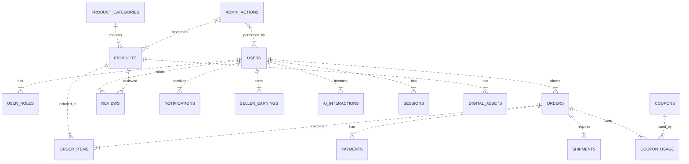

# EduMart Database Schema Design

This document outlines the MySQL database schema for the EduMart e-commerce platform. The design follows normalization principles, incorporates proper indexing strategies, and defines relationships to support all core functionalities.

## 1. Overview

- **Database**: MySQL 8.0+
- **ORM**: Sequelize (Node.js)
- **Design Principles**: 
  - Third Normal Form (3NF) where appropriate
  - Proper indexing for query performance
  - Constraints to ensure data integrity
  - Clear naming conventions
  - Support for both digital and physical product flows

## 2. Entity Relationship Diagram



## 3. Table Definitions

### 3.1 Users Table
Stores all user accounts (students, tutors, admins, institutes).

```sql
CREATE TABLE users (
    id CHAR(36) PRIMARY KEY DEFAULT (UUID()),
    email VARCHAR(255) NOT NULL UNIQUE,
    password_hash VARCHAR(255) NOT NULL,
    first_name VARCHAR(100) NOT NULL,
    last_name VARCHAR(100) NOT NULL,
    phone VARCHAR(20),
    role ENUM('student', 'tutor', 'admin', 'institute') NOT NULL DEFAULT 'student',
    is_verified BOOLEAN NOT NULL DEFAULT FALSE,
    verification_token VARCHAR(255),
    reset_token VARCHAR(255),
    reset_expires DATETIME,
    created_at TIMESTAMP DEFAULT CURRENT_TIMESTAMP,
    updated_at TIMESTAMP DEFAULT CURRENT_TIMESTAMP ON UPDATE CURRENT_TIMESTAMP,
    last_login DATETIME NULL,
    is_active BOOLEAN NOT NULL DEFAULT TRUE,
    INDEX idx_email (email),
    INDEX idx_role (role),
    INDEX idx_created_at (created_at)
) ENGINE=InnoDB DEFAULT CHARSET=utf8mb4 COLLATE=utf8mb4_unicode_ci;
```

### 3.2 User Roles (Alternative Design)
*Note: Role is stored directly in users table for simplicity. This table is shown for reference if role-based permissions become complex.*

```sql
CREATE TABLE user_roles (
    id INT AUTO_INCREMENT PRIMARY KEY,
    user_id CHAR(36) NOT NULL,
    role VARCHAR(50) NOT NULL,
    assigned_at TIMESTAMP DEFAULT CURRENT_TIMESTAMP,
    FOREIGN KEY (user_id) REFERENCES users(id) ON DELETE CASCADE,
    UNIQUE KEY unique_user_role (user_id, role),
    INDEX idx_user_id (user_id)
) ENGINE=InnoDB DEFAULT CHARSET=utf8mb4 COLLATE=utf8mb4_unicode_ci;
```

### 3.3 Product Categories
Hierarchical categorization system for products.

```sql
CREATE TABLE product_categories (
    id INT AUTO_INCREMENT PRIMARY KEY,
    name VARCHAR(100) NOT NULL UNIQUE,
    parent_id INT NULL,
    description TEXT,
    level INT NOT NULL DEFAULT 0,
    sort_order INT DEFAULT 0,
    is_active BOOLEAN NOT NULL DEFAULT TRUE,
    created_at TIMESTAMP DEFAULT CURRENT_TIMESTAMP,
    updated_at TIMESTAMP DEFAULT CURRENT_TIMESTAMP ON UPDATE CURRENT_TIMESTAMP,
    FOREIGN KEY (parent_id) REFERENCES product_categories(id) ON DELETE SET NULL,
    INDEX idx_parent_id (parent_id),
    INDEX idx_level (level),
    INDEX idx_is_active (is_active)
) ENGINE=InnoDB DEFAULT CHARSET=utf8mb4 COLLATE=utf8mb4_unicode_ci;
```

### 3.4 Products
Core product/listing information.

```sql
CREATE TABLE products (
    id CHAR(36) PRIMARY KEY DEFAULT (UUID()),
    seller_id CHAR(36) NOT NULL,
    category_id INT NOT NULL,
    title VARCHAR(255) NOT NULL,
    description TEXT NOT NULL,
    short_description VARCHAR(500),
    price DECIMAL(10, 2) NOT NULL CHECK (price >= 0),
    original_price DECIMAL(10, 2) NULL CHECK (original_price >= 0),
    sku VARCHAR(100) UNIQUE,
    subject VARCHAR(100) NOT NULL,
    grade_level VARCHAR(50) NOT NULL,
    exam_year YEAR NULL,
    product_type ENUM('past_paper', 'ebook', 'model_paper', 'revision_notes', 'lecture_pack', 'other') NOT NULL,
    format ENUM('digital', 'physical', 'both') NOT NULL DEFAULT 'digital',
    is_downloadable BOOLEAN NOT NULL DEFAULT FALSE,
    is_shippable BOOLEAN NOT NULL DEFAULT FALSE,
    file_size INT NULL, -- in KB for digital products
    pages INT NULL,
    language VARCHAR(50) DEFAULT 'English',
    isbn VARCHAR(20),
    publisher VARCHAR(255),
    publication_date DATE,
    condition ENUM('new', 'like_new', 'good', 'fair', 'poor') NULL,
    stock_quantity INT NOT NULL DEFAULT 0 CHECK (stock_quantity >= 0),
    reserve_stock INT NOT NULL DEFAULT 0 CHECK (reserve_stock >= 0),
    rating_average DECIMAL(3, 2) DEFAULT 0.00 CHECK (rating_average BETWEEN 0 AND 5),
    rating_count INT NOT NULL DEFAULT 0 CHECK (rating_count >= 0),
    is_featured BOOLEAN NOT NULL DEFAULT FALSE,
    is_active BOOLEAN NOT NULL DEFAULT TRUE,
    is_approved BOOLEAN NOT NULL DEFAULT FALSE,
    approved_at TIMESTAMP NULL,
    approved_by CHAR(36) NULL,
    created_at TIMESTAMP DEFAULT CURRENT_TIMESTAMP,
    updated_at TIMESTAMP DEFAULT CURRENT_TIMESTAMP ON UPDATE CURRENT_TIMESTAMP,
    published_at TIMESTAMP NULL,
    FOREIGN KEY (seller_id) REFERENCES users(id) ON DELETE RESTRICT,
    FOREIGN KEY (category_id) REFERENCES product_categories(id) ON DELETE RESTRICT,
    FOREIGN KEY (approved_by) REFERENCES users(id) ON DELETE SET NULL,
    INDEX idx_seller_id (seller_id),
    INDEX idx_category_id (category_id),
    INDEX idx_subject_grade (subject, grade_level),
    INDEX idx_exam_year (exam_year),
    INDEX idx_product_type (product_type),
    INDEX idx_format (format),
    INDEX idx_price (price),
    INDEX idx_is_active (is_active),
    INDEX idx_is_approved (is_approved),
    INDEX idx_created_at (created_at),
    FULLTEXT INDEX ft_title_description (title, description)
) ENGINE=InnoDB DEFAULT CHARSET=utf8mb4 COLLATE=utf8mb4_unicode_ci;
```

### 3.5 Digital Assets
Files associated with digital products.

```sql
CREATE TABLE digital_assets (
    id CHAR(36) PRIMARY KEY DEFAULT (UUID()),
    product_id CHAR(36) NOT NULL,
    file_name VARCHAR(255) NOT NULL,
    file_path VARCHAR(512) NOT NULL,
    file_size INT NOT NULL, -- in KB
    mime_type VARCHAR(100) NOT NULL,
    is_preview BOOLEAN NOT NULL DEFAULT FALSE,
    sort_order INT DEFAULT 0,
    download_count INT NOT NULL DEFAULT 0,
    created_at TIMESTAMP DEFAULT CURRENT_TIMESTAMP,
    updated_at TIMESTAMP DEFAULT CURRENT_TIMESTAMP ON UPDATE CURRENT_TIMESTAMP,
    FOREIGN KEY (product_id) REFERENCES products(id) ON DELETE CASCADE,
    INDEX idx_product_id (product_id),
    INDEX idx_is_preview (is_preview)
) ENGINE=InnoDB DEFAULT CHARSET=utf8mb4 COLLATE=utf8mb4_unicode_ci;
```

### 3.6 Orders
Customer purchase records.

```sql
CREATE TABLE orders (
    id CHAR(36) PRIMARY KEY DEFAULT (UUID()),
    user_id CHAR(36) NOT NULL,
    order_number VARCHAR(50) NOT NULL UNIQUE,
    status ENUM('pending', 'processing', 'paid', 'shipped', 'delivered', 'cancelled', 'refunded', 'failed') NOT NULL DEFAULT 'pending',
    subtotal DECIMAL(10, 2) NOT NULL CHECK (subtotal >= 0),
    tax_amount DECIMAL(10, 2) NOT NULL DEFAULT 0 CHECK (tax_amount >= 0),
    shipping_cost DECIMAL(10, 2) NOT NULL DEFAULT 0 CHECK (shipping_cost >= 0),
    discount_amount DECIMAL(10, 2) NOT NULL DEFAULT 0 CHECK (discount_amount >= 0),
    total_amount DECIMAL(10, 2) NOT NULL CHECK (total_amount >= 0),
    currency VARCHAR(3) NOT NULL DEFAULT 'USD',
    payment_status ENUM('pending', 'processing', 'paid', 'failed', 'refunded', 'partially_refunded') NOT NULL DEFAULT 'pending',
    shipping_address JSON,
    billing_address JSON,
    notes TEXT,
    created_at TIMESTAMP DEFAULT CURRENT_TIMESTAMP,
    updated_at TIMESTAMP DEFAULT CURRENT_TIMESTAMP ON UPDATE CURRENT_TIMESTAMP,
    completed_at TIMESTAMP NULL,
    FOREIGN KEY (user_id) REFERENCES users(id) ON DELETE RESTRICT,
    INDEX idx_user_id (user_id),
    INDEX idx_order_number (order_number),
    INDEX idx_status (status),
    INDEX idx_payment_status (payment_status),
    INDEX idx_created_at (created_at),
    INDEX idx_completed_at (completed_at)
) ENGINE=InnoDB DEFAULT CHARSET=utf8mb4 COLLATE=utf8mb4_unicode_ci;
```

### 3.7 Order Items
Line items within orders.

```sql
CREATE TABLE order_items (
    id CHAR(36) PRIMARY KEY DEFAULT (UUID()),
    order_id CHAR(36) NOT NULL,
    product_id CHAR(36) NOT NULL,
    quantity INT NOT NULL CHECK (quantity > 0),
    unit_price DECIMAL(10, 2) NOT NULL CHECK (unit_price >= 0),
    total_price DECIMAL(10, 2) NOT NULL CHECK (total_price >= 0),
    product_title VARCHAR(255) NOT NULL, -- denormalized for historical accuracy
    product_subject VARCHAR(100) NOT NULL,
    product_grade_level VARCHAR(50) NOT NULL,
    is_digital BOOLEAN NOT NULL,
    is_physical BOOLEAN NOT NULL,
    created_at TIMESTAMP DEFAULT CURRENT_TIMESTAMP,
    FOREIGN KEY (order_id) REFERENCES orders(id) ON DELETE CASCADE,
    FOREIGN KEY (product_id) REFERENCES products(id) ON DELETE RESTRICT,
    INDEX idx_order_id (order_id),
    INDEX idx_product_id (product_id),
    INDEX idx_order_product (order_id, product_id)
) ENGINE=InnoDB DEFAULT CHARSET=utf8mb4 COLLATE=utf8mb4_unicode_ci;
```

### 3.8 Payments
Transaction records for order payments.

```sql
CREATE TABLE payments (
    id CHAR(36) PRIMARY KEY DEFAULT (UUID()),
    order_id CHAR(36) NOT NULL,
    user_id CHAR(36) NOT NULL,
    amount DECIMAL(10, 2) NOT NULL CHECK (amount > 0),
    currency VARCHAR(3) NOT NULL DEFAULT 'USD',
    payment_method ENUM('credit_card', 'paypal', 'bank_transfer', 'digital_wallet') NOT NULL,
    provider VARCHAR(50) NOT NULL, -- e.g., 'stripe', 'paypal'
    provider_payment_id VARCHAR(255) UNIQUE,
    provider_fee DECIMAL(10, 2) DEFAULT 0,
    net_amount DECIMAL(10, 2) GENERATED AS (amount - provider_fee) STORED,
    status ENUM('pending', 'processing', 'completed', 'failed', 'refunded', 'partially_refunded') NOT NULL DEFAULT 'pending',
    gateway_response JSON,
    created_at TIMESTAMP DEFAULT CURRENT_TIMESTAMP,
    updated_at TIMESTAMP DEFAULT CURRENT_TIMESTAMP ON UPDATE CURRENT_TIMESTAMP,
    processed_at TIMESTAMP NULL,
    FOREIGN KEY (order_id) REFERENCES orders(id) ON DELETE CASCADE,
    FOREIGN KEY (user_id) REFERENCES users(id) ON DELETE RESTRICT,
    INDEX idx_order_id (order_id),
    INDEX idx_user_id (user_id),
    INDEX idx_provider_payment_id (provider_payment_id),
    INDEX idx_status (status),
    INDEX idx_created_at (created_at)
) ENGINE=InnoDB DEFAULT CHARSET=utf8mb4 COLLATE=utf8mb4_unicode_ci;
```

### 3.9 Reviews and Ratings
Product feedback from users.

```sql
CREATE TABLE reviews (
    id CHAR(36) PRIMARY KEY DEFAULT (UUID()),
    product_id CHAR(36) NOT NULL,
    user_id CHAR(36) NOT NULL,
    order_id CHAR(36) NULL, -- optional link to verifying purchase
    rating TINYINT NOT NULL CHECK (rating BETWEEN 1 AND 5),
    title VARCHAR(255),
    comment TEXT,
    is_verified_purchase BOOLEAN NOT NULL DEFAULT FALSE,
    helpful_votes INT NOT NULL DEFAULT 0 CHECK (helpful_votes >= 0),
    total_votes INT NOT NULL DEFAULT 0 CHECK (total_votes >= 0),
    is_approved BOOLEAN NOT NULL DEFAULT FALSE,
    approved_at TIMESTAMP NULL,
    approved_by CHAR(36) NULL,
    created_at TIMESTAMP DEFAULT CURRENT_TIMESTAMP,
    updated_at TIMESTAMP DEFAULT CURRENT_TIMESTAMP ON UPDATE CURRENT_TIMESTAMP,
    FOREIGN KEY (product_id) REFERENCES products(id) ON DELETE CASCADE,
    FOREIGN KEY (user_id) REFERENCES users(id) ON DELETE RESTRICT,
    FOREIGN KEY (order_id) REFERENCES orders(id) ON DELETE SET NULL,
    FOREIGN KEY (approved_by) REFERENCES users(id) ON DELETE SET NULL,
    INDEX idx_product_id (product_id),
    INDEX idx_user_id (user_id),
    INDEX idx_order_id (order_id),
    INDEX idx_rating (rating),
    INDEX idx_is_approved (is_approved),
    INDEX idx_created_at (created_at),
    INDEX idx_helpful_votes (helpful_votes)
) ENGINE=InnoDB DEFAULT CHARSET=utf8mb4 COLLATE=utf8mb4_unicode_ci;
```

### 3.10 Notifications
System notifications for users.

```sql
CREATE TABLE notifications (
    id CHAR(36) PRIMARY KEY DEFAULT (UUID()),
    user_id CHAR(36) NOT NULL,
    type ENUM('order_status', 'payment_status', 'shipping_update', 'new_product', 'promotion', 'review_reply', 'system_announcement', 'password_change', 'security_alert') NOT NULL,
    title VARCHAR(255) NOT NULL,
    message TEXT NOT NULL,
    is_read BOOLEAN NOT NULL DEFAULT FALSE,
    read_at TIMESTAMP NULL,
    related_id CHAR(36) NULL, -- polymorphic reference to order_id, product_id, etc.
    related_type VARCHAR(50) NULL, -- e.g., 'order', 'product'
    priority ENUM('low', 'normal', 'high', 'urgent') NOT NULL DEFAULT 'normal',
    expires_at TIMESTAMP NULL,
    created_at TIMESTAMP DEFAULT CURRENT_TIMESTAMP,
    FOREIGN KEY (user_id) REFERENCES users(id) ON DELETE CASCADE,
    INDEX idx_user_id (user_id),
    INDEX idx_is_read (is_read),
    INDEX idx_type (type),
    INDEX idx_priority (priority),
    INDEX idx_expires_at (expires_at),
    INDEX idx_created_at (created_at)
) ENGINE=InnoDB DEFAULT CHARSET=utf8mb4 COLLATE=utf8mb4_unicode_ci;
```

### 3.11 Coupons and Discounts
Promotional code management.

```sql
CREATE TABLE coupons (
    id CHAR(36) PRIMARY KEY DEFAULT (UUID()),
    code VARCHAR(50) NOT NULL UNIQUE,
    description VARCHAR(255),
    discount_type ENUM('percentage', 'fixed_amount', 'free_shipping') NOT NULL,
    discount_value DECIMAL(10, 2) NOT NULL CHECK (
        (discount_type = 'percentage' AND discount_value BETWEEN 0 AND 100) OR
        (discount_type = 'fixed_amount' AND discount_value >= 0) OR
        (discount_type = 'free_shipping')
    ),
    minimum_purchase DECIMAL(10, 2) DEFAULT 0 CHECK (minimum_purchase >= 0),
    maximum_discount DECIMAL(10, 2) NULL CHECK (maximum_discount >= 0),
    usage_limit INT NULL CHECK (usage_limit >= 0),
    usage_count INT NOT NULL DEFAULT 0 CHECK (usage_count >= 0),
    per_user_limit INT NULL CHECK (per_user_limit >= 0),
    starts_at TIMESTAMP NOT NULL,
    expires_at TIMESTAMP NOT NULL,
    is_active BOOLEAN NOT NULL DEFAULT TRUE,
    applicable_to ENUM('all', 'specific_products', 'specific_categories') NOT NULL DEFAULT 'all',
    created_at TIMESTAMP DEFAULT CURRENT_TIMESTAMP,
    updated_at TIMESTAMP DEFAULT CURRENT_TIMESTAMP ON UPDATE CURRENT_TIMESTAMP,
    INDEX idx_code (code),
    INDEX idx_is_active (is_active),
    INDEX idx_starts_at (starts_at),
    INDEX idx_expires_at (expires_at),
    INDEX idx_applicable_to (applicable_to)
) ENGINE=InnoDB DEFAULT CHARSET=utf8mb4 COLLATE=utf8mb4_unicode_ci;
```

### 3.12 Coupon Usage
Tracking coupon usage by users.

```sql
CREATE TABLE coupon_usage (
    id CHAR(36) PRIMARY KEY DEFAULT (UUID()),
    coupon_id CHAR(36) NOT NULL,
    user_id CHAR(36) NOT NULL,
    order_id CHAR(36) NOT NULL,
    discount_amount DECIMAL(10, 2) NOT NULL CHECK (discount_amount >= 0),
    used_at TIMESTAMP DEFAULT CURRENT_TIMESTAMP,
    FOREIGN KEY (coupon_id) REFERENCES coupons(id) ON DELETE CASCADE,
    FOREIGN KEY (user_id) REFERENCES users(id) ON DELETE RESTRICT,
    FOREIGN KEY (order_id) REFERENCES orders(id) ON DELETE RESTRICT,
    UNIQUE KEY unique_user_coupon_order (user_id, coupon_id, order_id),
    INDEX idx_coupon_id (coupon_id),
    INDEX idx_user_id (user_id),
    INDEX idx_order_id (order_id),
    INDEX idx_used_at (used_at)
) ENGINE=InnoDB DEFAULT CHARSET=utf8mb4 COLLATE=utf8mb4_unicode_ci;
```

### 3.13 Seller Earnings
Tracking revenue and payouts for sellers.

```sql
CREATE TABLE seller_earnings (
    id CHAR(36) PRIMARY KEY DEFAULT (UUID()),
    seller_id CHAR(36) NOT NULL,
    order_id CHAR(36) NOT NULL,
    product_id CHAR(36) NOT NULL,
    quantity INT NOT NULL CHECK (quantity > 0),
    sale_amount DECIMAL(10, 2) NOT NULL CHECK (sale_amount >= 0),
    platform_fee DECIMAL(10, 2) NOT NULL CHECK (platform_fee >= 0),
    payment_processing_fee DECIMAL(10, 2) NOT NULL CHECK (payment_processing_fee >= 0),
    net_earnings DECIMAL(10, 2) GENERATED AS (sale_amount - platform_fee - payment_processing_fee) STORED,
    currency VARCHAR(3) NOT NULL DEFAULT 'USD',
    status ENUM('pending', 'available', 'paid', 'held', 'refunded') NOT NULL DEFAULT 'pending',
    available_at TIMESTAMP NULL, -- when funds become available for withdrawal
    paid_at TIMESTAMP NULL,
    created_at TIMESTAMP DEFAULT CURRENT_TIMESTAMP,
    updated_at TIMESTAMP DEFAULT CURRENT_TIMESTAMP ON UPDATE CURRENT_TIMESTAMP,
    FOREIGN KEY (seller_id) REFERENCES users(id) ON DELETE RESTRICT,
    FOREIGN KEY (order_id) REFERENCES orders(id) ON DELETE RESTRICT,
    FOREIGN KEY (product_id) REFERENCES products(id) ON DELETE RESTRICT,
    INDEX idx_seller_id (seller_id),
    INDEX idx_order_id (order_id),
    INDEX idx_product_id (product_id),
    INDEX idx_status (status),
    INDEX idx_available_at (available_at),
    INDEX idx_created_at (created_at)
) ENGINE=InnoDB DEFAULT CHARSET=utf8mb4 COLLATE=utf8mb4_unicode_ci;
```

### 3.14 Shipments
Tracking physical product deliveries.

```sql
CREATE TABLE shipments (
    id CHAR(36) PRIMARY KEY DEFAULT (UUID()),
    order_id CHAR(36) NOT NULL,
    tracking_number VARCHAR(100) UNIQUE,
    carrier VARCHAR(100) NOT NULL,
    service_type VARCHAR(100),
    shipped_at TIMESTAMP NULL,
    estimated_delivery TIMESTAMP NULL,
    delivered_at TIMESTAMP NULL,
    status ENUM('pending', 'processing', 'shipped', 'out_for_delivery', 'delivered', 'failed', 'returned_to_sender') NOT NULL DEFAULT 'pending',
    shipping_cost DECIMAL(10, 2) NOT NULL CHECK (shipping_cost >= 0),
    insurance_amount DECIMAL(10, 2) DEFAULT 0,
    customs_value DECIMAL(10, 2) DEFAULT 0,
    notes TEXT,
    created_at TIMESTAMP DEFAULT CURRENT_TIMESTAMP,
    updated_at TIMESTAMP DEFAULT CURRENT_TIMESTAMP ON UPDATE CURRENT_TIMESTAMP,
    FOREIGN KEY (order_id) REFERENCES orders(id) ON DELETE CASCADE,
    INDEX idx_order_id (order_id),
    INDEX idx_tracking_number (tracking_number),
    INDEX idx_carrier (carrier),
    INDEX idx_status (status),
    INDEX idx_shipped_at (shipped_at),
    INDEX idx_delivered_at (delivered_at)
) ENGINE=InnoDB DEFAULT CHARSET=utf8mb4 COLLATE=utf8mb4_unicode_ci;
```

### 3.15 AI Interactions
Logging chatbot interactions for improvement and analytics.

```sql
CREATE TABLE ai_interactions (
    id CHAR(36) PRIMARY KEY DEFAULT (UUID()),
    user_id CHAR(36) NULL, -- nullable for anonymous users
    session_id VARCHAR(255) NOT NULL,
    message_text TEXT NOT NULL,
    response_text TEXT NOT NULL,
    intent VARCHAR(100) NOT NULL,
    confidence_score DECIMAL(3, 2) NULL CHECK (confidence_score BETWEEN 0 AND 1),
    language VARCHAR(10) DEFAULT 'en',
    is_helpful BOOLEAN NULL,
    feedback_rating TINYINT NULL CHECK (feedback_rating BETWEEN 1 AND 5),
    response_time_ms INT NOT NULL CHECK (response_time_ms >= 0),
    created_at TIMESTAMP DEFAULT CURRENT_TIMESTAMP,
    FOREIGN KEY (user_id) REFERENCES users(id) ON DELETE SET NULL,
    INDEX idx_user_id (user_id),
    INDEX idx_session_id (session_id),
    INDEX idx_intent (intent),
    INDEX idx_created_at (created_at),
    INDEX idx_is_helpful (is_helpful)
) ENGINE=InnoDB DEFAULT CHARSET=utf8mb4 COLLATE=utf8mb4_unicode_ci;
```

### 3.16 Sessions (Alternative to JWT)
*If using server-side sessions instead of stateless JWT*

```sql
CREATE TABLE sessions (
    id CHAR(36) PRIMARY KEY DEFAULT (UUID()),
    user_id CHAR(36) NOT NULL,
    token VARCHAR(255) NOT NULL UNIQUE,
    expires_at TIMESTAMP NOT NULL,
    ip_address VARCHAR(45) NULL,
    user_agent TEXT NULL,
    created_at TIMESTAMP DEFAULT CURRENT_TIMESTAMP,
    updated_at TIMESTAMP DEFAULT CURRENT_TIMESTAMP ON UPDATE CURRENT_TIMESTAMP,
    FOREIGN KEY (user_id) REFERENCES users(id) ON DELETE CASCADE,
    INDEX idx_user_id (user_id),
    INDEX idx_token (token),
    INDEX idx_expires_at (expires_at)
) ENGINE=InnoDB DEFAULT CHARSET=utf8mb4 COLLATE=utf8mb4_unicode_ci;
```

### 3.17 Admin Actions
Audit trail for administrative activities.

```sql
CREATE TABLE admin_actions (
    id CHAR(36) PRIMARY KEY DEFAULT (UUID()),
    admin_id CHAR(36) NOT NULL,
    action_type ENUM('product_approval', 'product_rejection', 'user_ban', 'user_activation', 'order_modification', 'refund_approval', 'coupon_creation', 'system_setting_change') NOT NULL,
    target_id CHAR(36) NULL, -- references product_id, user_id, order_id, etc.
    target_type VARCHAR(50) NULL,
    description TEXT NOT NULL,
    metadata JSON,
    ip_address VARCHAR(45) NULL,
    performed_at TIMESTAMP DEFAULT CURRENT_TIMESTAMP,
    FOREIGN KEY (admin_id) REFERENCES users(id) ON DELETE RESTRICT,
    INDEX idx_admin_id (admin_id),
    INDEX idx_action_type (action_type),
    INDEX idx_target_id (target_id),
    INDEX idx_performed_at (performed_at)
) ENGINE=InnoDB DEFAULT CHARSET=utf8mb4 COLLATE=utf8mb4_unicode_ci;
```

## 4. Indexing Strategy

### 4.1 Primary Indexes
- All tables use UUID(CHAR(36)) as primary key for distributed systems compatibility
- UUIDs are stored as CHAR(36) for readability and compatibility

### 4.2 Foreign Key Indexes
- Automatically created by InnoDB for all foreign key constraints
- Explicitly indexed for join performance

### 4.3 Query Optimization Indexes
- Composite indexes for common query patterns:
  - `products`: `(subject, grade_level)`, `(price)`, `(is_active, is_approved)`
  - `orders`: `(user_id, status)`, `(created_at)`, `(payment_status)`
  - `order_items`: `(order_id, product_id)`
  - `reviews`: `(product_id, rating)`, `(user_id)`
  - `notifications`: `(user_id, is_read)`, `(expires_at)`
  - `coupons`: `(code)`, `(starts_at, expires_at, is_active)`
  - `seller_earnings`: `(seller_id, status)`, `(available_at)`
  - `ai_interactions`: `(session_id)`, `(intent, created_at)`

### 4.4 Full-Text Search
- `products`: Full-text index on `title` and `description` for search functionality
- Supports boolean mode and natural language search

### 4.5 Partitioning Considerations
For high-volume tables (>10M rows), consider:
- `orders`: Partition by `created_at` (monthly or quarterly)
- `order_items`: Partition by `order_id` hash
- `reviews`: Partition by `created_at` (monthly)
- `ai_interactions`: Partition by `created_at` (daily)

## 5. Constraints and Data Integrity

### 5.1 Check Constraints
- Non-negative values for quantities, prices, amounts
- Rating values between 1-5
- Percentage values between 0-100
- Enum value validation

### 5.2 Foreign Key Constraints
- RESTRICT on deletions for critical references (e.g., product → order_item)
- CASCADE for dependent entities (e.g., order → order_item, payment)
- SET NULL for optional references (e.g., approved_by, reset_token)

### 5.3 Unique Constraints
- User email
- Order number
- Coupon code
- Shipment tracking number
- Payment provider IDs
- Session tokens

### 5.4 Not Null Constraints
- Essential fields: email, password_hash, names, timestamps
- Financial fields: amounts, prices
- Status fields: order status, payment status

## 6. Common Queries

### 6.1 Product Catalog Queries

**Get active products with pagination and filtering:**
```sql
SELECT 
    p.id, p.title, p.description, p.price, p.subject, p.grade_level,
    p.exam_year, p.product_type, p.format, p.rating_average, p.rating_count,
    u.first_name AS seller_first_name, u.last_name AS seller_last_name,
    pc.name AS category_name
FROM products p
JOIN users u ON p.seller_id = u.id
JOIN product_categories pc ON p.category_id = pc.id
WHERE p.is_active = TRUE 
    AND p.is_approved = TRUE
    AND (:subject IS NULL OR p.subject = :subject)
    AND (:grade_level IS NULL OR p.grade_level = :grade_level)
    AND (:exam_year IS NULL OR p.exam_year = :exam_year)
    AND (:product_type IS NULL OR p.product_type = :product_type)
    AND (:min_price IS NULL OR p.price >= :min_price)
    AND (:max_price IS NULL OR p.price <= :max_price)
ORDER BY p.created_at DESC
LIMIT :offset, :limit;
```

**Get product details with related assets:**
```sql
SELECT 
    p.*,
    u.first_name AS seller_first_name, u.last_name AS seller_last_name,
    pc.name AS category_name,
    JSON_ARRAYAGG(
        JSON_OBJECT(
            'id', da.id,
            'file_name', da.file_name,
            'file_path', da.file_path,
            'mime_type', da.mime_type,
            'is_preview', da.is_preview
        )
    ) AS digital_assets
FROM products p
JOIN users u ON p.seller_id = u.id
JOIN product_categories pc ON p.category_id = pc.id
LEFT JOIN digital_assets da ON p.id = da.product_id
WHERE p.id = :product_id
GROUP BY p.id;
```

### 6.2 Order Processing Queries

**Get user's order history:**
```sql
SELECT 
    o.id, o.order_number, o.status, o.payment_status, o.total_amount,
    o.created_at, o.completed_at,
    COUNT(oi.id) AS item_count,
    SUM(oi.quantity) AS total_quantity
FROM orders o
LEFT JOIN order_items oi ON o.id = oi.order_id
WHERE o.user_id = :user_id
    AND o.status NOT IN ('pending', 'cart') -- exclude carts if applicable
GROUP BY o.id
ORDER BY o.created_at DESC;
```

**Get order with items and product details:**
```sql
SELECT 
    o.*,
    u.first_name AS buyer_first_name, u.last_name AS buyer_last_name,
    oi.id AS order_item_id,
    oi.quantity, oi.unit_price, oi.total_price,
    p.id AS product_id, p.title AS product_title, p.subject, p.grade_level,
    p.exam_year, p.product_type
FROM orders o
JOIN users u ON o.user_id = u.id
JOIN order_items oi ON o.id = oi.order_id
JOIN products p ON oi.product_id = p.id
WHERE o.id = :order_id
ORDER BY oi.created_at;
```

### 6.3 Analytics and Reporting

**Daily sales report:**
```sql
SELECT 
    DATE(o.created_at) AS sale_date,
    COUNT(o.id) AS order_count,
    SUM(o.total_amount) AS gross_sales,
    SUM(se.net_earnings) AS net_sales,
    AVG(o.total_amount) AS average_order_value
FROM orders o
JOIN seller_earnings se ON o.id = se.order_id
WHERE o.created_at >= DATE_SUB(CURDATE(), INTERVAL 30 DAY)
    AND o.payment_status = 'paid'
    AND o.status IN ('delivered', 'shipped')
GROUP BY DATE(o.created_at)
ORDER BY sale_date DESC;
```

**Top selling products:**
```sql
SELECT 
    p.id, p.title, p.subject, p.grade_level,
    SUM(oi.quantity) AS units_sold,
    SUM(oi.total_price) AS revenue
FROM order_items oi
JOIN products p ON oi.product_id = p.id
JOIN orders o ON oi.order_id = o.id
WHERE o.payment_status = 'paid'
    AND o.created_at >= DATE_SUB(CURDATE(), INTERVAL 90 DAY)
GROUP BY p.id, p.title, p.subject, p.grade_level
ORDER BY units_sold DESC, revenue DESC
LIMIT 10;
```

**Coupon usage statistics:**
```sql
SELECT 
    c.code, c.description, c.discount_type, c.discount_value,
    COUNT(cu.id) AS usage_count,
    SUM(cu.discount_amount) AS total_discount,
    COUNT(DISTINCT cu.user_id) AS unique_users
FROM coupons c
LEFT JOIN coupon_usage cu ON c.id = cu.coupon_id
WHERE c.expires_at > NOW()
GROUP BY c.id
ORDER BY usage_count DESC;
```

### 6.4 User Engagement Queries

**Get user reviews with product info:**
```sql
SELECT 
    r.id, r.rating, r.title, r.comment, r.is_verified_purchase,
    r.created_at,
    p.id AS product_id, p.title AS product_title, p.subject,
    u.first_name AS reviewer_first_name, u.last_name AS reviewer_last_name
FROM reviews r
JOIN products p ON r.product_id = p.id
JOIN users u ON r.user_id = u.id
WHERE r.product_id = :product_id
    AND r.is_approved = TRUE
ORDER BY r.created_at DESC;
```

**Get AI interaction analytics:**
```sql
SELECT 
    intent,
    COUNT(*) AS interaction_count,
    AVG(confidence_score) AS avg_confidence,
    AVG(response_time_ms) AS avg_response_time,
    SUM(CASE WHEN is_helpful = TRUE THEN 1 ELSE 0 END) / COUNT(*) AS helpfulness_ratio
FROM ai_interactions
WHERE created_at >= DATE_SUB(NOW(), INTERVAL 7 DAY)
    AND user_id IS NOT NULL -- only logged-in users
GROUP BY intent
ORDER BY interaction_count DESC;
```

## 7. Sequelize Model Guidance

### 7.1 Basic Model Structure
```javascript
// models/user.js
module.exports = (sequelize, DataTypes) => {
  const User = sequelize.define('User', {
    id: {
      type: DataTypes.UUID,
      defaultValue: DataTypes.UUIDV4,
      primaryKey: true
    },
    email: {
      type: DataTypes.STRING(255),
      allowNull: false,
      unique: true,
      validate: {
        isEmail: true
      }
    },
    password_hash: {
      type: DataTypes.STRING(255),
      allowNull: false
    },
    first_name: {
      type: DataTypes.STRING(100),
      allowNull: false
    },
    last_name: {
      type: DataTypes.STRING(100),
      allowNull: false
    },
    phone: {
      type: DataTypes.STRING(20)
    },
    role: {
      type: DataTypes.ENUM('student', 'tutor', 'admin', 'institute'),
      allowNull: false,
      defaultValue: 'student'
    },
    is_verified: {
      type: DataTypes.BOOLEAN,
      allowNull: false,
      defaultValue: false
    },
    verification_token: {
      type: DataTypes.STRING(255)
    },
    reset_token: {
      type: DataTypes.STRING(255)
    },
    reset_expires: {
      type: DataTypes.DATE
    },
    last_login: {
      type: DataTypes.DATE
    },
    is_active: {
      type: DataTypes.BOOLEAN,
      allowNull: false,
      defaultValue: true
    }
  }, {
    tableName: 'users',
    timestamps: true,
    createdAt: 'created_at',
    updatedAt: 'updated_at',
    indexes: [
      { fields: ['email'] },
      { fields: ['role'] },
      { fields: ['created_at'] },
      { fields: ['is_active'] }
    ]
  });

  // Associations
  User.associate = (models) => {
    User.hasMany(models.Order, { foreignKey: 'user_id', as: 'orders' });
    User.hasMany(models.Review, { foreignKey: 'user_id', as: 'reviews' });
    User.hasMany(models.Notification, { foreignKey: 'user_id', as: 'notifications' });
    User.hasMany(models.SellerEarning, { foreignKey: 'seller_id', as: 'earnings' });
    User.hasMany(models.AiInteraction, { foreignKey: 'user_id', as: 'interactions' });
    User.hasMany(models.Session, { foreignKey: 'user_id', as: 'sessions' });
    User.belongsToMany(models.Product, { 
      through: 'CouponUsage', 
      foreignKey: 'user_id',
      otherKey: 'coupon_id',
      as: 'usedCoupons'
    });
  };

  return User;
};
```

### 7.2 Model Associations Example
```javascript
// models/order.js
module.exports = (sequelize, DataTypes) => {
  const Order = sequelize.define('Order', {
    id: {
      type: DataTypes.UUID,
      defaultValue: DataTypes.UUIDV4,
      primaryKey: true
    },
    order_number: {
      type: DataTypes.STRING(50),
      allowNull: false,
      unique: true
    },
    status: {
      type: DataTypes.ENUM('pending', 'processing', 'paid', 'shipped', 'delivered', 'cancelled', 'refunded', 'failed'),
      allowNull: false,
      defaultValue: 'pending'
    },
    subtotal: {
      type: DataTypes.DECIMAL(10, 2),
      allowNull: false,
      validate: {
        min: 0
      }
    },
    // ... other fields
  }, {
    tableName: 'orders',
    timestamps: true,
    createdAt: 'created_at',
    updatedAt: 'updated_at',
    indexes: [
      { fields: ['user_id'] },
      { fields: ['order_number'] },
      { fields: ['status'] },
      { fields: ['payment_status'] },
      { fields: ['created_at'] }
    ]
  });

  Order.associate = (models) => {
    Order.belongsTo(models.User, { foreignKey: 'user_id', as: 'user' });
    Order.hasMany(models.OrderItem, { foreignKey: 'order_id', as: 'items' });
    Order.hasOne(models.Payment, { foreignKey: 'order_id', as: 'payment' });
    Order.hasOne(models.Shipment, { foreignKey: 'order_id', as: 'shipment' });
    Order.hasMany(models.SellerEarning, { foreignKey: 'order_id', as: 'earnings' });
    Order.belongsToMany(models.Coupon, { 
      through: 'CouponUsage', 
      foreignKey: 'order_id',
      otherKey: 'coupon_id',
      as: 'coupons'
    });
    Order.belongsToMany(models.Review, { 
      foreignKey: 'order_id',
      as: 'reviews'
    });
  };

  return Order;
};
```

### 7.3 Query Examples with Sequelize

**Find products with filters:**
```javascript
const products = await Product.findAll({
  where: {
    is_active: true,
    is_approved: true,
    ...(subject && { subject }),
    ...(grade_level && { grade_level }),
    ...(exam_year && { exam_year }),
    ...(product_type && { product_type }),
    ...(min_price !== undefined && { price: { [Op.gte]: min_price } }),
    ...(max_price !== undefined && { price: { [Op.lte]: max_price } })
  },
  include: [
    {
      model: User,
      as: 'seller',
      attributes: ['first_name', 'last_name']
    },
    {
      model: ProductCategory,
      as: 'category',
      attributes: ['name']
    },
    {
      model: DigitalAsset,
      as: 'digitalAssets',
      attributes: ['id', 'file_name', 'file_path', 'mime_type', 'is_preview']
    }
  ],
  order: [['created_at', 'DESC']],
  limit: parseInt(limit),
  offset: parseInt(offset)
});
```

**Create order with items:**
```javascript
const order = await sequelize.transaction(async (t) => {
  // Create order
  const newOrder = await Order.create({
    user_id: userId,
    order_number: generateOrderNumber(),
    subtotal: cartSubtotal,
    tax_amount: taxAmount,
    shipping_cost: shippingCost,
    discount_amount: discountAmount,
    total_amount: totalAmount,
    status: 'pending',
    payment_status: 'pending'
  }, { transaction: t });

  // Create order items
  const orderItems = cartItems.map(item => ({
    order_id: newOrder.id,
    product_id: item.productId,
    quantity: item.quantity,
    unit_price: item.unitPrice,
    total_price: item.totalPrice,
    product_title: item.productTitle,
    product_subject: item.productSubject,
    product_grade_level: item.productGradeLevel,
    is_digital: item.isDigital,
    is_physical: item.isPhysical
  }));

  await OrderItem.bulkCreate(orderItems, { transaction: t });

  // Update product stock (if physical)
  const physicalItems = cartItems.filter(item => item.isPhysical);
  if (physicalItems.length > 0) {
    const productUpdates = physicalItems.map(item => 
      Product.update(
        { stock_quantity: Sequelize.literal(`stock_quantity - ${item.quantity}`) },
        { where: { id: item.productId }, transaction: t }
      );
    );
    await Promise.all(productUpdates);
  }

  return newOrder;
});
```

## 8. Migration Strategy

### 8.1 Version Control
Use Sequelize CLI for migrations:
```bash
# Initialize migrations
npx sequelize-cli init

# Create migration
npx sequelize-cli migration:generate --name create-users-table

# Run migrations
npx sequelize-cli db:migrate

# Undo last migration
npx sequelize-cli db:migrate:undo
```

### 8.2 Sample Migration File
```javascript
// migrations/20260728000001-create-users-table.js
'use strict';
module.exports = {
  up: async (queryInterface, Sequelize) => {
    await queryInterface.createTable('users', {
      id: {
        type: Sequelize.UUID,
        defaultValue: Sequelize.UUIDV4,
        primaryKey: true
      },
      email: {
        type: Sequelize.STRING(255),
        allowNull: false,
        unique: true
      },
      password_hash: {
        type: Sequelize.STRING(255),
        allowNull: false
      },
      first_name: {
        type: Sequelize.STRING(100),
        allowNull: false
      },
      last_name: {
        type: Sequelize.STRING(100),
        allowNull: false
      },
      phone: {
        type: Sequelize.STRING(20)
      },
      role: {
        type: Sequelize.ENUM('student', 'tutor', 'admin', 'institute'),
        allowNull: false,
        defaultValue: 'student'
      },
      is_verified: {
        type: Sequelize.BOOLEAN,
        allowNull: false,
        defaultValue: false
      },
      verification_token: {
        type: Sequelize.STRING(255)
      },
      reset_token: {
        type: Sequelize.STRING(255)
      },
      reset_expires: {
        type: Sequelize.DATE
      },
      last_login: {
        type: Sequelize.DATE
      },
      is_active: {
        type: Sequelize.BOOLEAN,
        allowNull: false,
        defaultValue: true
      },
      created_at: {
        type: Sequelize.DATE,
        allowNull: false,
        defaultValue: Sequelize.NOW
      },
      updated_at: {
        type: Sequelize.DATE,
        allowNull: false,
        defaultValue: Sequelize.NOW
      }
    }, {
      engine: 'INNODB',
      charset: 'utf8mb4',
      collate: 'utf8mb4_unicode_ci'
    });

    // Add indexes
    await queryInterface.addIndex('users', ['email']);
    await queryInterface.addIndex('users', ['role']);
    await queryInterface.addIndex('users', ['created_at']);
    await queryInterface.addIndex('users', ['is_active']);
  },

  down: async (queryInterface, Sequelize) => {
    await queryInterface.dropTable('users');
  }
};
```

### 8.3 Data Seeding
Use seeders for initial data:
```bash
# Create seeder
npx sequelize-cli seed:generate --name demo-users

# Run seeders
npx sequelize-cli db:seed:all
```

**Sample seeder:**
```javascript
// seeders/demo-users.js
'use strict';
const bcrypt = require('bcryptjs');

module.exports = {
  up: async (queryInterface, Sequelize) => {
    const passwordHash = await bcrypt.hash('securePassword123', 12);
    
    await queryInterface.bulkInsert('users', [
      {
        id: '11111111-1111-1111-1111-111111111111',
        email: 'admin@edumart.com',
        password_hash: passwordHash,
        first_name: 'System',
        last_name: 'Administrator',
        role: 'admin',
        is_verified: true,
        is_active: true,
        created_at: new Date(),
        updated_at: new Date()
      },
      {
        id: '22222222-2222-2222-2222-222222222222',
        email: 'tutor@example.com',
        password_hash: passwordHash,
        first_name: 'John',
        last_name: 'Tutor',
        role: 'tutor',
        is_verified: true,
        is_active: true,
        created_at: new Date(),
        updated_at: new Date()
      }
    ], {});
  },

  down: async (queryInterface, Sequelize) => {
    await queryInterface.bulkDelete('users', null, {});
  }
};
```

## 9. Performance Optimization

### 9.1 Connection Pooling
Configure Sequelize connection pool:
```javascript
const sequelize = new Sequelize(process.env.DATABASE_URL, {
  pool: {
    max: 20,
    min: 5,
    acquire: 30000,
    idle: 10000
  }
});
```

### 9.2 Read Replicas
For read-heavy operations:
```javascript
// Configure read replica for SELECT queries
const readSequelize = new Sequelize(process.env.READ_REPLICA_URL);
// Use readSequelize for:
// - Product catalog browsing
// - User profile views
// - Order history queries
// - Analytics queries
```

### 9.3 Caching Strategy
- **Product catalog**: Redis cache with TTL 15-60 minutes
- **User sessions**: Redis with TTL matching JWT expiry (15-30 min)
- **Frequently accessed data**: Application-level caching (LRU cache)
- **Static assets**: CDN caching

### 9.4 Database Optimization Tips
1. **Use EXPLAIN**: Analyze slow queries regularly
2. **Avoid SELECT \***: Select only needed columns
3. **Use proper JOINs**: Ensure indexed columns in JOIN conditions
4. **Limit result sets**: Always use LIMIT for lists unless absolutely necessary
5. **Consider covering indexes**: For queries that only need indexed columns
6. **Archive old data**: Move orders older than 2 years to archive tables
7. **Monitor slow queries**: Enable slow query log in MySQL

## 10. Security Considerations

### 10.1 Data Protection
- **PII Encryption**: Consider application-level encryption for:
  - Email addresses (if extremely sensitive)
  - Phone numbers
  - Address information
- **Password Storage**: bcrypt with cost factor 12 (as implemented)
- **Token Storage**: Hash sensitive tokens (reset, verification) like passwords

### 10.2 Access Control
- **Principle of Least Privilege**: Database user should have only necessary permissions
- **Separate Users**: Different DB users for application vs. migrations/admin tasks
- **Row-Level Security**: Consider views or stored procedures for multi-tenant scenarios (if needed)

### 10.3 Input Validation
- **Always validate**: Never trust user input, even with ORM
- **Use parameterized queries**: Sequelize does this automatically
- **Sanitize outputs**: For XSS prevention in rendered content

### 10.4 Audit Logging
- **Admin actions**: Already implemented in `admin_actions` table
- **Data changes**: Consider triggers for critical tables or application-level logging
- **Failed logins**: Track in `users` table or separate security log table

## 11. Backup and Recovery

### 11.1 Backup Strategy
- **Full backups**: Daily during off-peak hours
- **Incremental backups**: Every 4 hours
- **Transaction logs**: Enabled for point-in-time recovery
- **Test restores**: Quarterly restore tests

### 11.2 Disaster Recovery
- **RTO (Recovery Time Objective)**: < 4 hours
- **RPO (Recovery Point Objective)**: < 1 hour
- **Cross-region replication**: For critical production systems
- **Automated failover**: Using MySQL Group Replication or similar

## 12. Future Enhancements

### 12.1 Planned Schema Extensions
- **Product bundles**: For selling multiple products together
- **Subscription model**: For recurring access to materials
- **Advanced analytics**: Pre-aggregated tables for reporting
- **Geo-location**: For region-specific pricing/content
- **Multi-language support**: Expanded language fields

### 12.2 Performance Improvements
- **Materialized views**: For complex analytics queries
- **Sharding consideration**: If exceeding single instance capacity
- **In-memory tables**: For session data or caching layer
- **Vector search**: For semantic product search (using MySQL 8.0+ vector capabilities)

## 13. Conclusion

This schema provides a solid foundation for the EduMart e-commerce platform, supporting all required functionalities while maintaining data integrity, performance, and scalability. The design balances normalization with practical query performance considerations, uses appropriate data types and constraints, and includes comprehensive indexing for common access patterns.

An executable SQL file containing this schema is available at `sql/database_schema.sql` for direct database implementation.

Regular review and optimization of this schema based on actual usage patterns and performance metrics is recommended as the platform evolves.