# EduMart Technical Architecture

## 1. Overview
This document outlines the technical architecture of the EduMart e-commerce platform for educational materials. The system follows a modern web application architecture with a clear separation of concerns between frontend, backend, and data layers.

## 2. Architectural Goals
- **Scalability**: Designed to handle growing user base and transaction volume
- **Maintainability**: Clean separation of concerns and modular design
- **Security**: Robust protection for user data and financial transactions
- **Performance**: Fast response times and efficient resource utilization
- **Extensibility**: Easy to add new features and integrate third-party services
- **Reliability**: High availability and fault tolerance

## 3. High-Level Architecture

### 3.0 System Context Diagram
```mermaid
graph TD
    A[User Browser/Mobile App] -->|HTTPS/WSS| B[EduMart Platform]
    B --> C[Web Application<br>React.js Frontend]
    B --> D[API Gateway<br>Node.js/Express]
    D --> E[Authentication Service]
    D --> F[Catalog Service]
    D --> G[Cart Service]
    D --> H[Order Service]
    D --> I[Payment Service]
    D --> J[Notification Service]
    D --> K[Review Service]
    D --> L[Admin Service]
    D --> M[AI Chatbot Service]
    E --> N[(User Database)]
    F --> N
    G --> N
    H --> N
    I --> N
    J --> N
    K --> N
    L --> N
    M --> N
    B --> O[External Services<br>Payment Gateways, Email, SMS, Twilio]
    B --> P[File Storage<br>AWS S3/Local]
    B --> Q[Search Engine<br>Elasticsearch (Optional)]
    B --> R[Message Queue<br>RabbitMQ/Kafka (Optional)]
    B --> S[CDN<br>Cloudflare/AWS CloudFront]
```

### 3.1 Technology Stack

| Layer | Technology | Version | Purpose |
| ------- | ------------ | ------- | ------- |
| **Frontend** | React.js | 18.x | SPA UI with hooks & context |
| | React Router | 6.x | Client-side routing |
| | Redux Toolkit | 1.x | State management (alternative to Context) |
| | Axios/Fetch | Latest | HTTP client for API calls |
| | CSS Modules/Styled Components | Latest | Component-scoped styling |
| | Vite/Create React App | Latest | Build tool & dev server |
| **Backend** | Node.js | 18.x LTS | JavaScript runtime |
| | Express.js | 4.x | Web framework & API routing |
| | GraphQL Yoga/Apollo Server | Optional | GraphQL API layer |
| | Sequelize | 6.x | ORM for MySQL |
| | MySQL | 8.0+ | Relational data storage |
| | Redis | 7.x | Caching & session store |
| | JWT | RFC 7519 | Authentication tokens |
| | bcrypt | Latest | Password hashing |
| **Infrastructure** | Docker | Latest | Containerization |
| | Kubernetes/Docker Swarm | Optional | Orchestration |
| | NGINX/Traefik | Latest | Reverse proxy & load balancing |
| | Cloudflare/AWS CloudFront | Latest | CDN & DDoS protection |
| | AWS S3/MinIO | Latest | Object storage for files |
| | Elasticsearch/OpenSearch | Optional | Advanced search capabilities |
| | RabbitMQ/Apache Kafka | Optional | Message queuing & streaming |
| **Services** | Stripe/PayPal SDK | Latest | Payment processing |
| | SendGrid/Nodemailer | Latest | Email service |
| | Twilio/Nexmo | Latest | SMS service |
| | TensorFlow.js/Natural | Optional | NLP for chatbot |
| | Jest/React Testing Library | Latest | Testing framework |
| | SuperTest | Latest | API testing |
| | Cypress/Playwright | Latest | E2E testing |
| | ESLint/Prettier | Latest | Code quality & formatting |
| | Husky/Lint-staged | Latest | Git hooks |
| | npm/yarn/pnpm | Latest | Package management |
| | Git/GitHub/GitLab | Latest | Version control |
| | SonarQube/Snyk | Optional | Security & quality scanning |
| | AWS/GCP/Azure | Optional | Cloud provider (if used) |
| | Terraform/Pulumi/Terragrunt | Optional | IaC for cloud resources |

### 3.2 User Journey Diagrams

#### 3.2.1 User Registration and Login Flow

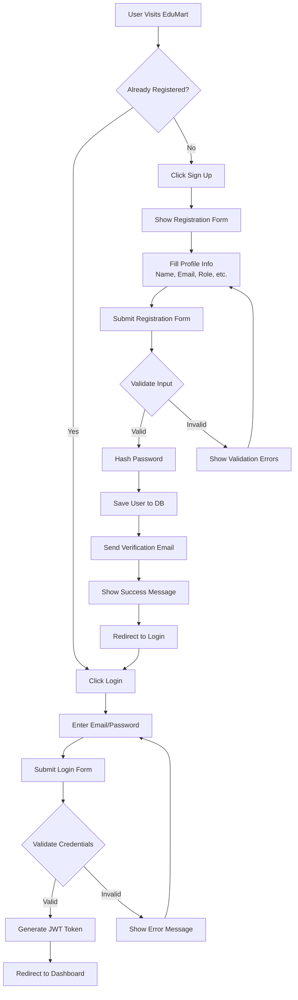

#### 3.2.2 Product Browse and Search Flow

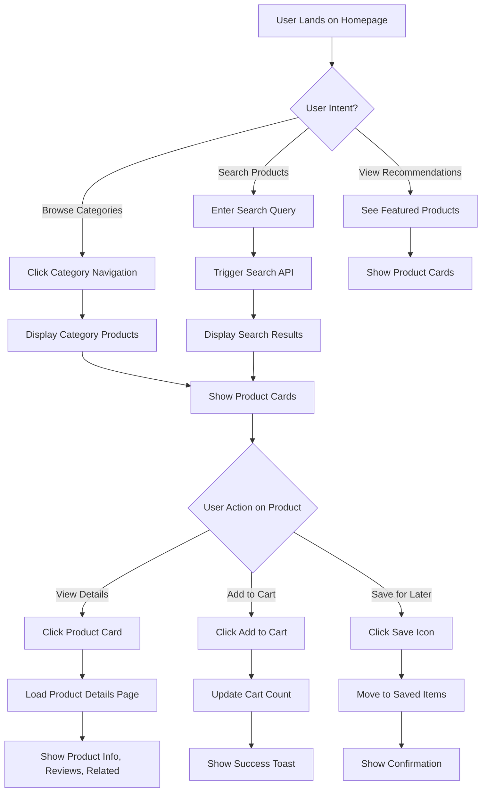

#### 3.2.3 Shopping Cart and Checkout Flow

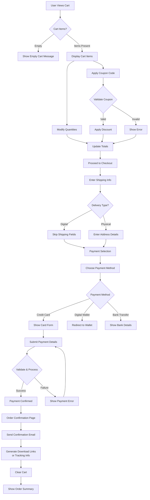

#### 3.2.4 Seller Product Upload Flow (Tutor/Instructor)

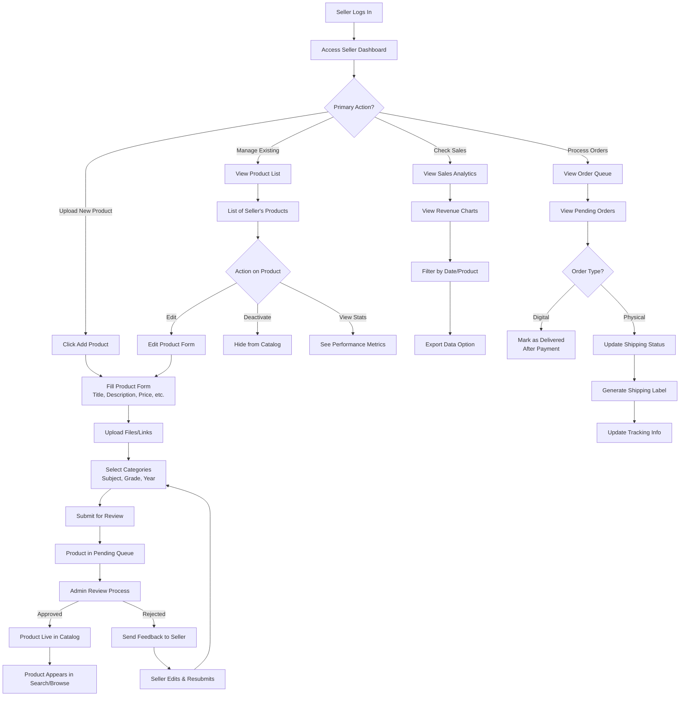
```

### 3.3 Component Interaction Diagrams

#### 3.3.1 Payment Processing Flow
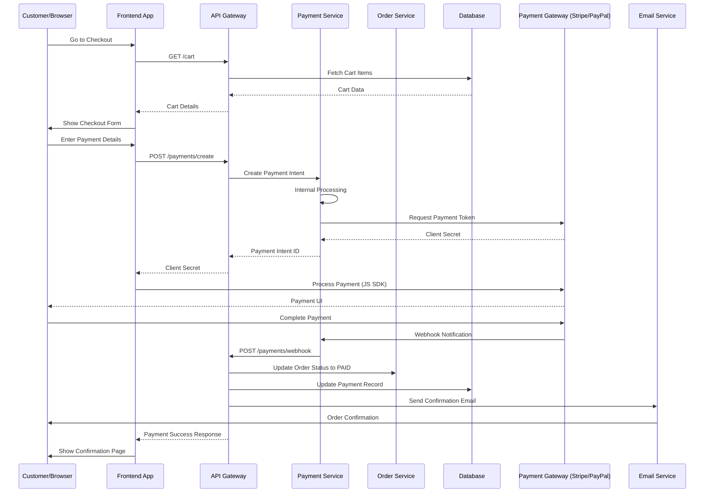

#### 3.3.2 AI Chatbot Interaction Flow
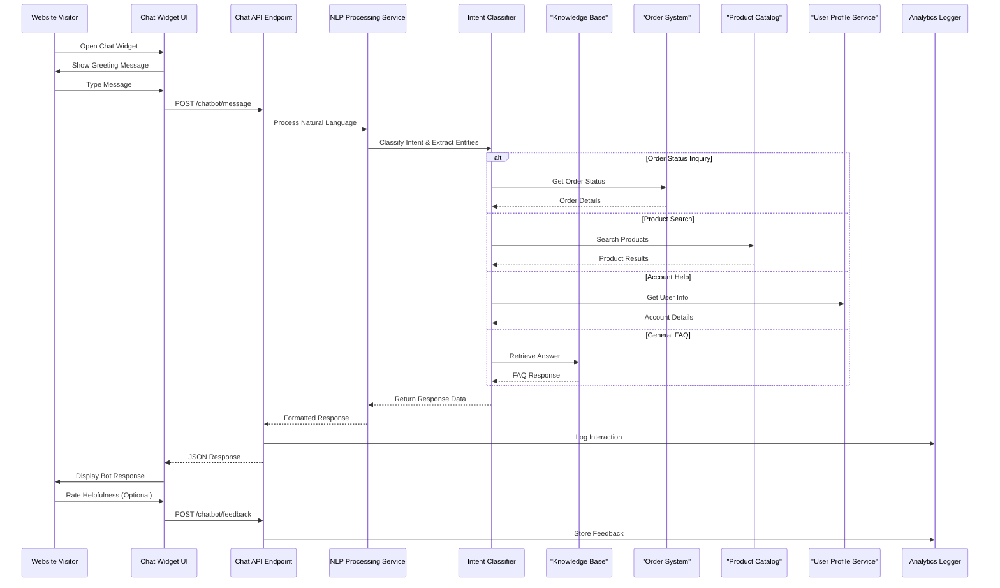
```

#### 3.3.3 Notification System Flow
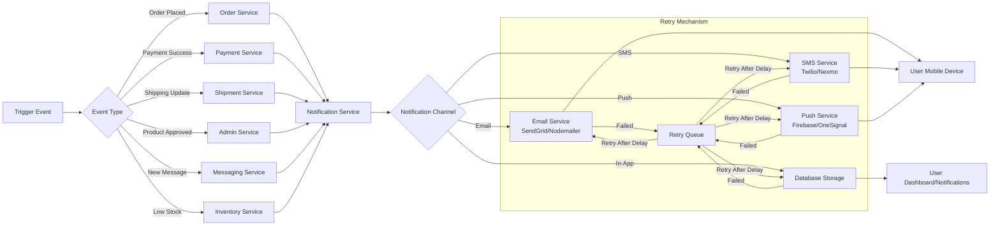

### 3.4 Data Flow Diagrams

#### 3.4.1 Product Catalog Data Flow
```mermaid
flowchart TD
    A[Seller/Admin] --> B[Product Management UI]
    B --> C{Action}
    C -->|Create/Update| D[Form Validation]
    D --> E[File Upload to S3/Local Storage]
    E --> F[Generate Metadata]
    F --> G[Create Product Record in MySQL]
    G --> H[Index in Search Engine Elasticsearch (Optional)]
    H --> I[Cache Product Data Redis]
    I --> J[Product Available in Catalog]
    B -->|Delete| K[Soft Delete Flag]
    K --> L[Remove from Search Index]
    L --> M[Clear Cache]
    
    subgraph Read Operations
        N[User Browser] --> O[Search/Browse UI]
        O --> P[Query Cache First]
        P -->|Hit| Q[Return Cached Data]
        P -->|Miss| R[Query Database]
        R --> S[Apply Filters/Sorting]
        S --> T[Format Response]
        T --> U[Return to Frontend]
        U --> V[Display Product List]
        V --> W[User Views Product Details]
        W --> X[Fetch Specific Product]
        X --> Y[Check Cache]
        Y -->|Hit| Z[Return Cached Product]
        Y -->|Miss| AA[Query Database]
        AA --> AB[Return Product Details]
        AB --> AC[Show Product Page]
    end
    
    subgraph Admin Moderation
        AD[Admin] --> AE[Moderation Queue]
        AE --> AF[Review Product]
        AF --> AG{Approve/Reject}
        AG -->|Approve| AH[Set Active Flag]
        AH --> AI[Notify Seller]
        AI --> AJ[Make Searchable]
        AJ --> AK[Clear Cache for Reindex]
        AG -->|Reject| AL[Set Rejected Flag]
        AL --> AM[Notify Seller with Reason]
    end
```

#### 3.4.2 Order Processing Data Flow
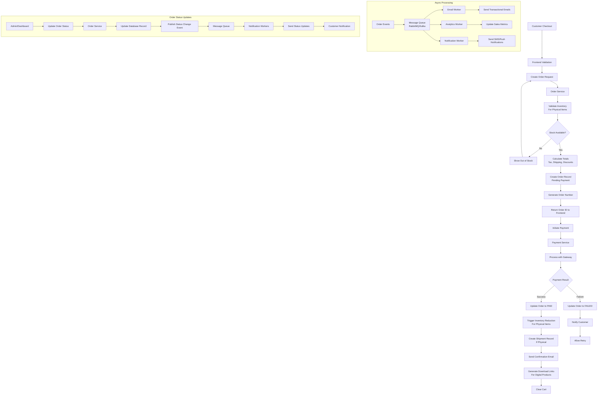

#### 3.4.3 Digital Delivery Data Flow
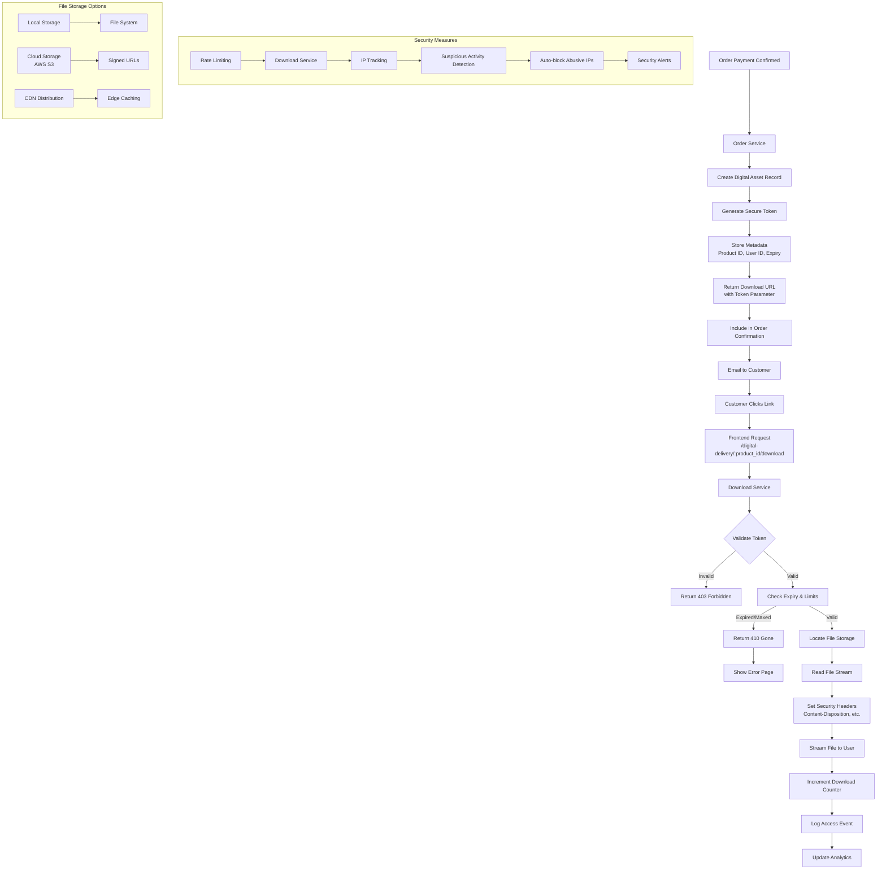

### 3.5 Security Architecture Diagrams

#### 3.5.1 Authentication and Authorization Flow
```mermaid
flowchart TD
    A[User Login Attempt] --> B[Rate Limiter Max 5 attempts/min]
    B --> C{Too Many Attempts?}
    C -->|Yes| D[Return 429 Too Many Requests]
    D --> E[Log Security Event]
    C -->|No| F[Input Validation Sanitize & Validate]
    F --> G{Valid Input?}
    G -->|No| H[Return 400 Bad Request]
    H --> I[Log Validation Error]
    G -->|Yes| J[Check Credentials vs Database]
    J --> K{Credentials Valid?}
    K -->|No| L[Return 401 Unauthorized]
    L --> M[Increment Failed Attempts]
    M --> N[Log Failed Login]
    K -->|Yes| O[Generate JWT Token with Claims]
    O --> P[Set HttpOnly Cookie OR Return Token]
    P --> Q[Create Session Record in Redis/Database]
    Q --> R[Return User Data (exclude password)]
    R --> S[Log Successful Login]
    S --> T[Redirect to Dashboard]
    
    subgraph Token Validation Middleware
        U[Protected Route Request] --> V[Extract Token from Header/Cookie]
        V --> W{Token Present?}
        W -->|No| X[Return 401 Unauthorized]
        W -->|Yes| Y[Verify Signature & Expiry]
        Y -->|Invalid| Z[Return 401 Unauthorized]
        Z --> AA[Log Invalid Token]
        Y -->|Valid| AB[Check Token Blacklist Revocation List]
        AB -->|Blacklisted| AC[Return 401 Unauthorized]
        AC --> AD[Log Revoked Token Use]
        AB -->|Not Blacklisted| AE[Extract User ID/Permissions]
        AE --> AF[Attach User to Request]
        AF --> AG[Proceed to Route Handler]
    end
    
    subgraph Role-Based Access Control
        AH[Request Handler] --> AI{User Role Required?}
        AI -->|No| AJ[Proceed with Request]
        AI -->|Yes| AK[Check User Role vs Required Role]
        AK -->|Insufficient| AL[Return 403 Forbidden]
        AL --> AM[Log Access Denial]
        AK -->|Sufficient| AN[Proceed with Request]
    end
```

#### 3.5.2 Data Protection and Encryption
```mermaid
graph TD
    A[Data In Motion] --> B[TLS 1.3 Encryption]
    B --> C[All API Endpoints]
    C --> D[WebSocket Connections]
    D --> E[Service-to-Service Communication]
    
    F[Data At Rest] --> G[Database Encryption]
    G --> H[AES-256 for PII]
    H --> I[Email Addresses]
    H --> J[Phone Numbers]
    H --> K[Address Information]
    L[File Storage Encryption] --> M[S3 Server-Side Encryption]
    M --> N[Customer Uploaded Files]
    M --> O[Digital Product Files]
    N --> P[Client-Side Encryption Option for Sensitive Files]
    
    Q[Secrets Management] --> R[Environment Variables]
    R --> S[Database Passwords]
    R --> T[API Keys]
    R --> U[Payment Gateway Credentials]
    R --> V[Third-party Service Tokens]
    W[Hashing] --> X[Passwords: bcrypt (cost: 12)]
    X --> Y[Password Reset Tokens: SHA-256]
    Y --> Z[Email Verification Tokens: SHA-256]
    Z --> AA[API Keys: HMAC-SHA256]
    
    subgraph Input/Output Protection
        AB[Input Validation] --> AC[Server-side Validation]
        AC --> AD[Parameterized Queries]
        AD --> AE[ORM Usage Prevents SQLi]
        AF[Output Encoding] --> AG[HTML Entity Encoding]
        AG --> AH[Prevents XSS]
        AI[Content Security Policy] --> AJ[Restricts Resource Loading]
        AK[JSON Web Tokens] --> AL[Short Expiry (15-30min)]
        AL --> AM[Refresh Token Rotation]
    end
    
    subgraph Security Headers
        AN[HTTP Responses] --> AO[Set Security Headers]
        AO --> AP[Strict-Transport-Security]
        AO --> AQ[X-Content-Type-Options: nosniff]
        AO --> AR[X-Frame-Options: DENY]
        AO --> AS[X-XSS-Protection: 1; mode: block]
        AO --> AT[Referrer-Policy: strict-origin-when-cross-origin]
        AU[Content-Security-Policy] --> AV[Default Sources Self]
    end
```

#### 3.5.3 Payment Security Flow

```mermaid
sequenceDiagram
    participant Customer as Customer/Browser
    participant Frontend as Frontend (React)
    participant API as API Gateway
    participant Payment as Payment Service
    participant Vault as Secrets Manager/Vault
    participant Gateway as Payment Gateway (Stripe/PayPal)
    participant Bank as Issuing Bank
    participant Fraud as Fraud Detection Service
    
    Customer->>Frontend: Enter Payment Details
    Frontend->>API: POST /payments/create
    API->>Vault: Retrieve API Credentials
    Vault-->>API: Encrypted Credentials
    API->>Payment: Create Payment Intent
    Payment->>Payment: Validate Amount/Currency
    Payment->>Fraud: Request Risk Assessment
    Fraud->>Fraud: Check Velocity Rules
    Fraud->>Fraud: Check Blacklists
    Fraud->>Fraud: Analyze Patterns
    Fraud-->>Payment: Risk Score
    alt High Risk
        Payment->>API: Require Additional Verification
        API-->>Frontend: Request 3D Secure
        Frontend->>Customer: Show 3DS Challenge
        Customer->>Bank: Complete Authentication
        Bank-->>Gateway: Authentication Result
        Gateway-->>Payment: 3DS Status
    end
    Payment->>Gateway: Process Payment
    Gateway->>Bank: Authorization Request
    Bank-->>Gateway: Approve/Decline
    Gateway-->>Payment: Transaction Result
    Payment->>API: Update Payment Status
    API->>Database: Record Transaction
    API->>Email: Send Receipt
    Email->>Customer: Payment Confirmation
    API-->>Frontend: Payment Result
    Frontend->>Customer: Show Success/Failure
    
    subgraph Security Measures
        Note left of Customer: No Card Data Touches Our Servers
        Note right of Frontend: No Card Data Touches Our Servers
        Note left of Payment: Tokenization Only
        Note left of Vault: Encrypted at Rest
        Note left of Gateway: PCI DSS Compliant
    end
```

### 3.6 Deployment Architecture Diagrams

#### 3.6.1 Development Environment
```mermaid
flowchart LR
    A[Developer Machine] --> B[Local Development Stack]
    B --> C[Docker Compose]
    C --> D[Frontend Container React/Vite Dev Server]
    C --> E[Backend Container Node.js/Express]
    C --> F[Database Container MySQL]
    C --> G[Cache Container Redis]
    C --> H[Message Queue RabbitMQ (Optional)]
    C --> I[MailHog Email Testing]
    C --> J[MinIO S3 Emulator]
    D --> K[HModule Replacement]
    E --> L[Auto-restart on Changes]
    F --> M[Pre-seeded Test Data]
    G --> N[Dev Configuration]
    H --> O[Development Queues]
    I --> P[Email Preview Interface]
    J --> Q[Local File Storage]
    
    subgraph Developer Tools
        R[VS Code] --> S[Extensions]
        S --> T[ESLint/Prettier]
        S --> U[Debugger]
        S --> V[Git Integration]
        W[Postman/Newman] --> X[API Testing]
        Y[Jest] --> Z[Unit Testing Framework]
    end
```

#### 3.6.2 Staging Environment
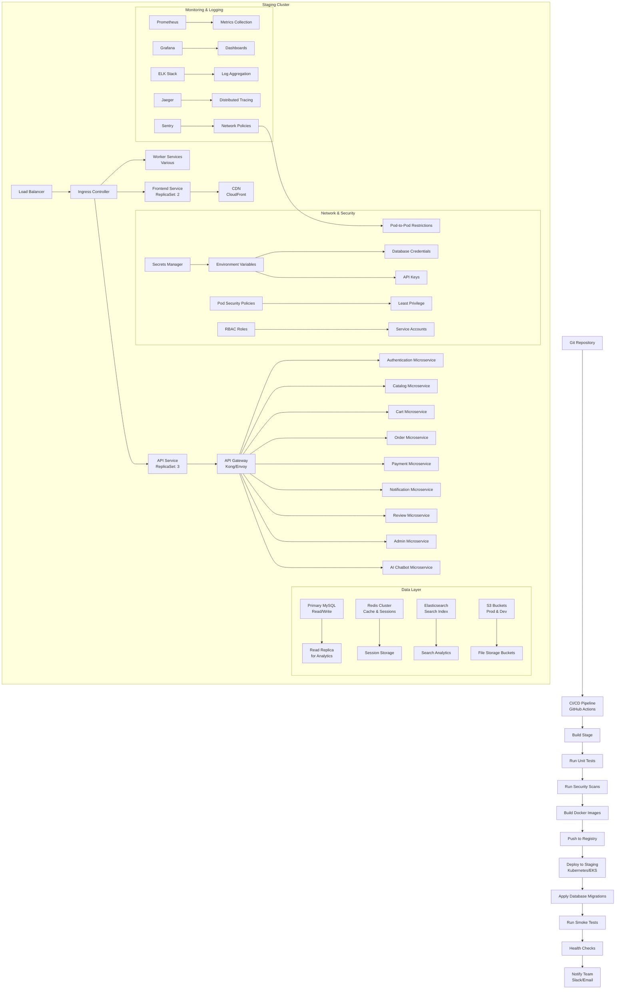

#### 3.6.3 Production Environment (High Availability)
```mermaid
graph TD
    A[Internet Traffic] --> B[Global Load Balancer<br>Cloudflare/AWS ALB]
    B --> C[Regional Load Balancers<br>Multiple AZs]
    C --> D[Auto Scaling Groups<br>Frontend Servers]
    C --> E[Auto Scaling Groups<br>API Servers]
    C --> F[Auto Scaling Groups<br>Worker Services]
    
    subgraph Web Tier
        D --> G[Container Instances<br>ECS/EKS/Fargate]
        G --> H[React App<br>Static Assets]
        H --> I[S3 Bucket<br>Hosted Assets]
        I --> J[CloudFront CDN<br>Global Distribution]
    end
    
    subgraph API Tier
        E --> K[Container Instances<br>ECS/EKS/Fargate]
        K --> L[API Gateway<br>Rate Limiting]
        L --> M[Service Mesh<br>Istio/Linkerd (Optional)]
        M --> N[Authentication Service]
        M --> O[Catalog Service]
        M --> P[Cart Service]
        M --> Q[Order Service]
        M --> R[Payment Service]
        M --> S[Notification Service]
        M --> T[Review Service]
        M --> U[Admin Service]
        M --> V[AI Chatbot Service]
        
        subgraph Service Discovery
            W[Consul/Eureka] --> X[Service Registration]
            X --> Y[Health Checks]
            Y --> Z[Circuit Breaker]
        end
    end
    
    subgraph Data Tier
        AA[Database Cluster<br>MySQL Galera/PXC] --> AB[Primary Writer]
        AB --> AC[Read Replicas<br>3+ Nodes]
        AC --> AD[Load Balancer<br>ProxySQL]
        AE[ElastiCache Redis<br>Cluster Mode] --> AF[Primary Shard]
        AF --> AG[Replica Shards<br>2+]
        AH[Search Engine<br>OpenSearch] --> AI[Primary Node]
        AI --> AJ[Replica Nodes<br>2+]
        AK[Object Storage<br>S3 Multi-AZ] --> AL[Versioning Enabled]
        AL --> AM[Cross-Region Replication<br>DR]
    end
    
    subgraph Supporting Services
        AN[Message Queue<br>Amazon MQ/RabbitMQ Cluster] --> AO[Durable Queues]
        AO --> AP[Dead Letter Queues]
        AQ[Email Service<br>SES/SendGrid] --> AR[Delivery Tracking]
        AS[SMS Service<br>Twilio/Nexmo] --> AT[Delivery Reports]
        AU[Monitoring Stack<br>Prometheus/Grafana] --> AV[Custom Dashboards]
        AW[Logging Stack<br>EFK/OpenSearch] --> AX[Log Retention: 90 Days]
        AY[Tracing<br>Jaeger/Tempo] --> AZ[Trace Retention: 7 Days]
        BA[Secrets Manager<br>AWS Secrets Manager] --> BB[Automatic Rotation]
        BC[Backup/Vault<br>AWS Backup] --> BD[Daily Snapshots]
        BE[Disaster Recovery<br>Cross-Region] --> BF[RTO: <4 Hours]
    end
    
    subgraph Network & Security
        BG[VPC] --> BH[Public Subnets<br>Load Balancers]
        BH --> BI[Private Subnets<br>Application Servers]
        BI --> BJ[Isolated Subnets<br>Database Layer]
        BK[Security Groups] --> BL[Least Privilege Access]
        BM[WAF] --> BN[OWASP Protection Rules]
        BO[DDoS Protection] --> BP[Automatic Mitigation]
        BQ[VPC Flow Logs] --> BR[Security Monitoring]
        BS[Certificate Manager] --> BT[Automatic SSL Renewal]
    end
```

### 3.7 Data Flow Diagrams (DFD)

#### 3.7.1 Level 0: Context Diagram
```mermaid
flowchart TD
    A[External Entities] --> B[EduMart E-Commerce Platform]
    subgraph External Entities
        C[Customers/Students] -->|Browse, Purchase, Review| B
        D[Sellers/Tutors] -->|Upload Products, Manage Sales| B
        E[Administrators] -->|Manage System, Moderate Content| B
        F[Payment Gateways<br>Stripe/PayPal] -->|Process Payments, Webhooks| B
        G[Email Service Providers<br>SendGrid/SMTP] -->|Send Notifications| B
        H[SMS Providers<br>Twilio/Nexmo] -->|Send Alerts| B
        I[Shipping Carriers<br>FedEx/UPS/DHL] -->|Tracking Updates| B
        J[Search Engines<br>Google/Bing] -->|SEO Traffic| B
        K[Social Media<br>FB/Twitter/IG] -->|Social Sharing| B
        L[Analytics Services<br>Google Analytics] -->|Usage Data| B
    end
    B -->|Product Catalog, Pricing, Availability| C
    B -->|Order Status, Shipping Notices| C
    B -->|Payment Receipts, Invoices| C
    B -->|Account Statements, Earnings| D
    B -->|Sales Reports, Customer Insights| D
    B -->|User Management, Content Approval| E
    B -->|Transaction Details, Fees| F
    B -->|Delivery Status, Bounce Info| G
    B -->|Delivery Confirmation, Errors| H
    B -->|Search Rankings, Click-through| I
    B -->|Referral Traffic, Engagement| J
    B -->|Shareable Content, Promotions| K
    B -->|Behavioral Data, Conversion Rates| L
```

#### 3.7.2 Level 1: Major Processes

```mermaid
flowchart TD
    A[Process 1: Customer Management] --> B[External Entity: Customers]
    B -->|Registration/Login Requests| A
    A -->|Account Updates, Preferences| B
    A -->|Order History, Wishlist| B
    A -->|Loyalty Points, Rewards| B
    
    C[Process 2: Product Catalog Management] --> D[External Entity: Sellers]
    D -->|Product Uploads, Updates| C
    C -->|Approval Status, Feedback| D
    C -->|Sales Analytics, Inventory Alerts| D
    C -->|Category Management, Taxonomy| E[External Entity: Administrators]
    E -->|Category Approvals, Bulk Operations| C
    
    E[Process 3: Order Processing] --> F[External Entity: Customers]
    F -->|Cart Additions, Checkout Requests| E
    E -->|Order Confirmation, Status Updates| F
    E -->|Payment Receipts, Shipping Notifications| F
    E -->|Return/Refund Initiation, Tracking| F
    E -->|Sales Notifications, Inventory Updates| G[External Entity: Sellers]
    G -->|Order Fulfillment, Shipping Updates| E
    
    H[Process 4: Payment Processing] --> I[External Entity: Payment Gateways]
    I -->|Payment Authorization Requests| H
    H -->|Transaction Results, Webhooks| I
    H -->|Payment Reconciliation Reports| J[External Entity: Administrators]
    J -->|Dispute Management, Chargebacks| H
    
    K[Process 5: Notification System] --> L[External Entity: Customers]
    K -->|Order/Shipping Alerts| L
    L -->|Preference Updates, Opt-outs| K
    K -->|Promotional Campaigns| M[External Entity: Marketers]
    M -->|Campaign Performance, ROI| K
    K -->|Delivery Receipts, Engagement Metrics| N[External Entity: SMS/Email Providers]
    N -->|Bounce Rates, Spam Complaints| K
    
    O[Process 6: Content Moderation] --> P[External Entity: Administrators]
    P -->|Content Review Requests| O
    O -->|Moderation Decisions, Appeals| P
    O -->|Published/Rejected Content| Q[External Entity: Sellers]
    Q -->|Content Revisions, Resubmissions| O
    
    R[Process 7: Search & Discovery] --> S[External Entity: Customers]
    S -->|Search Queries, Filter Requests| R
    R -->|Search Results, Recommendations| S
    S -->|Click-through Rates, Dwell Time| T[External Entity: Analytics Services]
    T -->|Search Relevance, Popularity Metrics| R
    
    subgraph Data Stores
        U[(User Accounts & Profiles)]
        V[(Product Catalog & Metadata)]
        W[(Orders & Transactions)]
        X[(Payments & Financials)]
        Y[(Reviews & Ratings)]
        Z[(Notifications & Communications)]
        AA[(Search Index & Analytics)]
        AB[(Session & Cache)]
    end
    
    A -->|Read/Write| U
    A -->|Read| V
    A -->|Read/Write| W
    A -->|Read| X
    A -->|Read/Write| Y
    A -->|Read/Write| Z
    A -->|Read| AA
    A -->|Read/Write| AB
    
    C -->|Read/Write| V
    C -->|Read| U
    C -->|Read| W
    
    E -->|Read/Write| W
    E -->|Read| U
    E -->|Read| V
    E -->|Read/Write| X
    
    H -->|Read/Write| X
    H -->|Read| U
    H -->|Read| W
    
    K -->|Read/Write| Z
    K -->|Read| U
    K -->|Read| W
    
    O -->|Read/Write| Y
    O -->|Read| V
    O -->|Read| U
    
    R -->|Read| V
    R -->|Read| U
    R -->|Read| Y
    R -->|Read/Write| AA
```

#### 3.7.3 Level 2: Detailed Processes (Example: Order Processing)

```mermaid
flowchart TD
    A[Process 3.1: Cart Management] --> B[External Entity: Customer]
    B -->|Add/Remove Items, Update Quantities| A
    A -->|Cart Contents, Subtotal, Tax Estimate| B
    A -->|Save for Later, Move to Wishlist| B
    A -->|Apply Coupon Code, Validate Discount| B
    A -->|Cart Abandonment Reminders Scheduled| B
    
    C[Process 3.2: Order Creation] --> D[External Entity: Customer]
    D -->|Checkout Initiation, Shipping/Billing Info| C
    C -->|Order Confirmation, Order Number| D
    C -->|Payment Authorization Request| E[Process 3.3: Payment Processing]
    E -->|Payment Approval/Decline| C
    C -->|Inventory Reservation| F[Process 3.4: Inventory Management]
    F -->|Stock Availability, Allocation| C
    C -->|Order Persistence| G[(Order Database)]
    C -->|Order Event Publication| H[Message Queue]
    
    E[Process 3.3: Payment Processing] --> I[External Entity: Payment Gateway]
    I -->|Payment Tokenization Requests| E
    E -->|Payment Processing Results| I
    E -->|Fraud Screening Requests| J[Fraud Detection Service]
    J -->|Risk Score, Recommendation| E
    E -->|Payment Settlement Files| K[External Entity: Bank/Acquirer]
    
    F[Process 3.4: Inventory Management] --> L[External Entity: Warehouse System]
    L -->|Stock Levels, Reorder Points| F
    L -->|Allocation/Deallocation Requests| L
    L -->|Allocation Confirmation, Backorder Info| F
    F -->|Inventory Adjustments (Returns/Damages)| L
    L -->|Stock Update Confirmations| F
    
    M[Process 3.5: Fulfillment & Shipping] --> N[External Entity: Shipping Carrier]
    M -->|Shipping Label Requests| N
    N -->|Label Generation, Tracking Numbers| M
    M -->|Package Scan Events| N
    N -->|Scan Updates, Delivery Status| M
    N -->|Delivery Confirmation, Signature Proof| N
    N -->|Delivery Exception Notifications| M
    M -->|Shipping Documentation| L[External Entity: Customs/Border Control]
    
    O[Process 3.6: Post-Order Activities] --> P[External Entity: Customer]
    P -->|Review/Rating Submission| O
    O -->|Review Publication, Moderation Queue| P
    O -->|Loyalty Points Award, Referral Credit| P
    O -->|Email/SMS Notification Preferences| O
    O -->|Account Activity Updates| P
    
    subgraph Data Stores
        Q[(Shopping Cart Sessions)]
        R[(Order Header & Line Items)]
        S[(Payment Transactions & Gateways)]
        T[(Inventory Allocation & Reservations)]
        U[(Shipment Tracking & Carriers)]
        V[(Customer Communications & Preferences)]
        W[(Loyalty Points & Referrals)]
        X[(Product Reviews & Ratings)]
    end
    
    A -->|Read/Write| Q
    A -->|Read| R
    A -->|Read| S
    A -->|Read| T
    A -->|Read| U
    A -->|Read| V
    A -->|Read| W
    
    C -->|Read/Write| R
    C -->|Read/Write| S
    C -->|Read/Write| T
    C -->|Read| U
    C -->|Read| V
    C -->|Read| W
    C -->|Read/Write| X
    
    E -->|Read/Write| S
    E -->|Read| R
    E -->|Read| T
    E -->|Read| U
    E -->|Read| V
    E -->|Read| W
    
    F -->|Read/Write| T
    F -->|Read| R
    F -->|Read| S
    F -->|Read| U
    F -->|Read| V
    F -->|Read| W
    
    M -->|Read/Write| U
    M -->|Read| R
    M -->|Read| S
    M -->|Read| T
    M -->|Read| V
    M -->|Read| W
    
    O -->|Read/Write| V
    O -->|Read/Write| W
    O -->|Read/Write| X
    O -->|Read| R
    O -->|Read| S
    O -->|Read| T
    O -->|Read| U
```

### 3.8 Component Communication Matrix

| Component | Auth Service | Catalog Service | Cart Service | Order Service | Payment Service | Notification Service | Review Service | Admin Service | AI Chatbot |
|-----------|--------------|-----------------|--------------|---------------|-----------------|----------------------|----------------|---------------|------------|
| **Auth Service** | - | Validates tokens for read access | Validates tokens for cart ops | Validates tokens for order ops | Validates tokens for payment | Validates tokens for preferences | Validates tokens for review | Full admin access | Validates tokens for chat |
| **Catalog Service** | User roles for access | - | Product availability for cart | Product info for orders | Product pricing for payment | New product alerts | Product reviews display | Full CRUD access | Product search queries |
| **Cart Service** | User session association | Product details & pricing | - | Order creation items | Cart total for payment | Abandoned cart reminders | - | Admin cart inspection | Cart-based recommendations |
| **Order Service** | User ownership verification | Product details for line items | Cart items conversion | - | Payment status updates | Shipping/delivery notifications | Review requests post-delivery | Order management & refunds | Order status inquiries |
| **Payment Service** | User ownership verification | Product pricing for amounts | Cart totals for processing | Order payment linking | - | Payment success/failure alerts | - | Transaction reports & refunds | Payment method guidance |
| **Notification Service** | User preferences for channels | Product availability alerts | Cart abandonment alerts | Order status updates | Payment confirmation/status | - | Review requests/replies | System announcements & alerts | Chat session notifications |
| **Review Service** | User verification for posting | Product association for reviews | - | Order verification for purchase | - | Review notification emails | - | Moderation queue & actions | Sentiment analysis & spam detection |
| **Admin Service** | Elevated privileges required | Full catalog control | Cart inspection for support | Full order access | Full transaction access | Notification template management | Full review moderation | - | Admin chatbot oversight & training |
| **AI Chatbot** | User context & auth | Product info & search | Cart & order status help | Order status & history | Payment issues & refunds | Notification preferences & troubleshooting | Review submission help | Limited admin functions | - |

**Communication Patterns:**
- **Synchronous**: REST/GraphQL APIs for real-time interactions
- **Asynchronous**: Message queues for event-driven workflows
- **Database**: Direct reads/writes for shared data access
- **Cache**: Redis for session storage and frequent reads
- **File Storage**: S3/Local for binary assets with signed URLs
- **External Services**: Webhooks/APIs for payment, email, SMS, shipping

### 3.9 Deployment Architecture

#### 3.9.1 Environment Strategy

```mermaid
flowchart LR
    A[Development Environment] --> B[Feature Branches]
    B --> C[Pull Request Review]
    C --> D[Automated Testing]
    D --> E[Staging Environment]
    E --> F[Integration Testing]
    F --> G[Performance Testing]
    G --> H[Security Scanning]
    H --> I[Production Deployment]
    I --> J[Monitoring & Alerting]
    J --> K[Feedback Loop]
    K --> A
    
    subgraph Development
        L[Local Dev: Docker Compose] --> M[Individual Services]
        M --> N[Hot Reload & Debugging]
    end
    
    subgraph Staging
        O[Staging: Near-Prod Parity] --> P[Full Service Stack]
        P --> Q[Realistic Data Sets]
        Q --> R[Load Testing Environment]
    end
    
    subgraph Production
        S[Prod: High Availability] --> T[Multi-AZ Deployment]
        T --> U[Blue-Green/Canary Deployments]
        U --> V[Auto-scaling Groups]
        V --> W[Disaster Recovery Site]
    end
    
    subgraph Shared Services
        X[Shared: CI/CD Pipeline] --> Y[GitHub Actions/GitLab CI]
        Y --> Z[Artifact Repository]
        Z --> AA[Container Registry]
        AA --> AB[Infrastructure as Code]
        AB --> AC[Terraform/Pulumi/Terragrunt]
    end
    
    subgraph Monitoring & Observability
        AD[Metrics: Prometheus/Grafana] --> AE[Dashboards & Alerts]
        AF[Logs: ELK/EFK/OpenSearch] --> AG[Centralized Logging & Search]
        AH[Tracing: Jaeger/Tempo] --> AI[Distributed Tracing & Latency Analysis]
    end
```

#### 3.9.2 Container Orchestration (Kubernetes Example)
```mermaid
graph TD
    A[Ingress Controller] --> B[Frontend Service]
    A --> C[API Service]
    A --> D[Worker Services]
    
    subgraph Frontend
        B --> E[Deployment: react-app]
        E --> F[ReplicaSet: 3]
        F --> G[Pod: react-app]
        G --> H[Container: React/Vite]
    end
    
    subgraph API
        C --> I[Deployment: node-api]
        I --> J[ReplicaSet: 4]
        J --> K[Pod: node-api]
        K --> L[Container: Node.js/Express]
    end
    
    subgraph Workers
        D --> M[Deployment: email-worker]
        M --> N[ReplicaSet: 2]
        N --> O[Pod: email-worker]
        O --> P[Container: Node.js]
        
        D --> Q[Deployment: notification-worker]
        Q --> R[ReplicaSet: 2]
        R --> S[Pod: notification-worker]
        S --> T[Container: Node.js]
    end
    
    subgraph Storage
        U[PersistentVolumeClaims] --> V[MySQL Data]
        U --> W[Redis Data]
        U --> X[Uploaded Files]
    end
    
    subgraph Config & Secrets
        Y[ConfigMaps] --> Z[App Configuration]
        AA[Secrets] --> AB[DB Credentials]
        AA --> AC[API Keys]
        AA --> AD[Payment Gateway Keys]
    end
```

#### 3.9.3 Service Mesh Communication (Istio Example)

```mermaid
flowchart LR
    A[Ingress Gateway] --> B[Service Mesh]
    B --> C[Authentication Service]
    B --> D[Catalog Service]
    B --> E[Cart Service]
    B --> F[Order Service]
    B --> G[Payment Service]
    B --> H[Notification Service]
    B --> I[Review Service]
    B --> J[Admin Service]
    B --> K[AI Chatbot Service]
    
    subgraph Service Mesh
        C --> L[Sidecar Proxy]
        D --> M[Sidecar Proxy]
        E --> N[Sidecar Proxy]
        F --> O[Sidecar Proxy]
        G --> P[Sidecar Proxy]
        H --> Q[Sidecar Proxy]
        I --> R[Sidecar Proxy]
        J --> S[Sidecar Proxy]
        K --> T[Sidecar Proxy]
    end
    
    subgraph Telemetry
        U[Prometheus] --> V[Metrics]
        W[Jaeger] --> X[Traces]
        Y[Fluentd] --> Z[Logs]
    end
```

### 3.10 Technology Stack Summary

| Layer | Technology | Version | Purpose |
| ------- | ------------ | ------- | ------- |
| **Frontend** | React.js | 18.x | SPA UI with hooks & context |
| | React Router | 6.x | Client-side routing |
| | Redux Toolkit | 1.x | State management (alternative to Context) |
| | Axios/Fetch | Latest | HTTP client for API calls |
| | CSS Modules/Styled Components | Latest | Component-scoped styling |
| | Vite/Create React App | Latest | Build tool & dev server |
| **Backend** | Node.js | 18.x LTS | JavaScript runtime |
| | Express.js | 4.x | Web framework & API routing |
| | GraphQL Yoga/Apollo Server | Optional | GraphQL API layer |
| | Sequelize | 6.x | ORM for MySQL |
| | MySQL | 8.0+ | Relational data storage |
| | Redis | 7.x | Caching & session store |
| | JWT | RFC 7519 | Authentication tokens |
| | bcrypt | Latest | Password hashing |
| **Infrastructure** | Docker | Latest | Containerization |
| | Kubernetes/Docker Swarm | Optional | Orchestration |
| | NGINX/Traefik | Latest | Reverse proxy & load balancing |
| | Cloudflare/AWS CloudFront | Latest | CDN & DDoS protection |
| | AWS S3/MinIO | Latest | Object storage for files |
| | Elasticsearch/OpenSearch | Optional | Advanced search capabilities |
| | RabbitMQ/Apache Kafka | Optional | Message queuing & streaming |
| **Services** | Stripe/PayPal SDK | Latest | Payment processing |
| | SendGrid/Nodemailer | Latest | Email service |
| | Twilio/Nexmo | Latest | SMS service |
| | TensorFlow.js/Natural | Optional | NLP for chatbot |
| | Jest/React Testing Library | Latest | Testing framework |
| | SuperTest | Latest | API testing |
| | Cypress/Playwright | Latest | E2E testing |
| | ESLint/Prettier | Latest | Code quality & formatting |
| | Husky/Lint-staged | Latest | Git hooks |
| | npm/yarn/pnpm | Latest | Package management |
| | Git/GitHub/GitLab | Latest | Version control |
| | SonarQube/Snyk | Optional | Security & quality scanning |
| | AWS/GCP/Azure | Optional | Cloud provider (if used) |
| | Terraform/Pulumi/Terragrunt | Optional | IaC for cloud resources |

---

## 4. Component Architecture

### 4.1 Frontend Architecture (React.js)

```
src/
├── components/
│   ├── layout/           # Header, footer, layout components
│   ├── ui/               # Reusable UI components (buttons, forms, modals)
│   ├── pages/            # Page-level components (Home, Product, Cart, etc.)
│   ├── hooks/            # Custom React hooks
│   ├── utils/            # Utility functions and helpers
│   ├── context/          # React Context providers (Auth, Cart, etc.)
│   └── services/         # API service modules
├── hooks/                # Custom React hooks
├── utils/                # Utility helpers and constants
├── context/              # React Context API providers
├── services/             # API service layers
├── routes/               # React Router configuration
├── assets/               # Static assets (images, icons)
├── styles/               # CSS modules or styled components
└── App.js                # Main application component
```

#### Key Frontend Patterns

- **Component-Based Architecture**: Reusable, composable UI components
- **State Management**: React Context for global state (auth, cart, user)
- **Data Fetching**: Custom hooks for API communication with caching
- **Routing**: React Router for client-side navigation
- **Form Handling**: Controlled components with validation
- **Error Boundaries**: Graceful error handling and fallback UIs
- **Lazy Loading**: Code splitting for performance optimization

### 4.2 Backend Architecture (Node.js/Express)

```text
src/
├── middleware/           # Custom Express middleware
│   ├── auth.js          # Authentication middleware
│   ├── validation.js    # Request validation
│   ├── errorHandler.js  # Centralized error handling
│   └── rateLimiter.js   # Rate limiting for security
├── controllers/          # Request handlers (route controllers)
│   ├── authController.js
│   ├── productController.js
│   ├── cartController.js
│   ├── orderController.js
│   ├── userController.js
│   ├── adminController.js
│   └── reviewController.js
├── services/             # Business logic layer
│   ├── authService.js
│   ├── productService.js
│   ├── cartService.js
│   ├── orderService.js
│   ├── userService.js
│   ├── adminService.js
│   └── reviewService.js
├── models/               # Database models (Sequelize)
│   ├── User.js
│   ├── Product.js
│   ├── Order.js
│   ├── CartItem.js
│   ├── Review.js
│   └── Notification.js
├── routes/               # API route definitions
│   ├── authRoutes.js
│   ├── productRoutes.js
│   ├── cartRoutes.js
│   ├── orderRoutes.js
│   ├── userRoutes.js
│   ├── adminRoutes.js
│   └── reviewRoutes.js
├── middleware/           # Custom middleware
├── utils/                # Utility helpers
├── config/               # Configuration files
├── validators/           # Request validation schemas
└── app.js                # Express application setup
```

#### Key Backend Patterns
- **MVC-inspired Structure**: Separation of concerns with models, views (JSON responses), and controllers
- **Service Layer**: Business logic separated from controllers for testability
- **Middleware Chain**: Authentication, validation, logging, error handling
- **RESTful API Design**: Resource-based endpoints with standard HTTP methods
- **Dependency Injection**: Services injected where needed for loose coupling
- **Error Handling**: Centralized error handling with proper HTTP status codes
- **Input Validation**: Server-side validation of all incoming data
- **Security Middleware**: Helmet, CORS, rate limiting, sanitization

### 4.3 Database Design (MySQL)

#### Core Entities

1. **Users**
   - id (PK)
   - email (unique)
   - password_hash
   - first_name, last_name
   - phone (optional)
   - role (student/tutor/institute/admin)
   - status (active/suspended/pending)
   - created_at, updated_at
   - last_login_at

2. **Products (Materials)**
   - id (PK)
   - seller_id (FK to Users)
   - title, description
   - category, subcategory
   - grade_level, subject
   - material_type (past_paper, ebook, model_paper, notes, video)
   - format (digital/physical/both)
   - price
   - stock_quantity (for physical items)
   - is_active
   - created_at, updated_at
   - preview_file_path (for digital previews)

3. **Orders**
   - id (PK)
   - buyer_id (FK to Users)
   - total_amount
   - status (pending/processing/shipped/delivered/cancelled)
   - payment_status
   - shipping_address (JSON)
   - billing_address (JSON)
   - created_at, updated_at

4. **Order Items**
   - id (PK)
   - order_id (FK to Orders)
   - product_id (FK to Products)
   - quantity
   - price_at_purchase
   - created_at

5. **Shopping Cart**
   - id (PK)
   - user_id (FK to Users)
   - product_id (FK to Products)
   - quantity
   - added_at

6. **Reviews**
   - id (PK)
   - product_id (FK to Products)
   - user_id (FK to Users - reviewer)
   - rating (1-5)
   - comment
   - is_approved (for moderation)
   - created_at, updated_at

7. **Notifications**
   - id (PK)
   - user_id (FK to Users)
   - title, message
   - type (order/status/promotion/system)
   - is_read
   - created_at

8. **Password Resets** (if implemented)
   - id (PK)
   - user_id (FK to Users)
   - token (hashed)
   - expires_at
   - created_at

9. **Digital Delivery Assets**
   - id (PK)
   - product_id (FK to Products)
   - file_path
   - file_size
   - mime_type
   - download_url (temporary or permanent)
   - access_token (for secure downloads)
   - expires_at
   - max_downloads
   - current_downloads
   - created_at

10. **Physical Shipments**
    - id (PK)
    - order_id (FK to Orders)
    - tracking_number
    - carrier
    - status (pending, shipped, in_transit, delivered, failed)
    - estimated_delivery
    - actual_delivery
    - shipping_cost
    - created_at
    - updated_at

11. **Coupons & Promotions**
    - id (PK)
    - code (unique)
    - description
    - discount_type (percentage/fixed_amount)
    - discount_value
    - min_purchase_amount
    - max_discount_amount
    - start_date
    - end_date
    - usage_limit
    - used_count
    - is_active
    - applicable_to (all/products/categories)
    - created_at

12. **AI Chatbot Interactions**
    - id (PK)
    - user_id (FK to Users, nullable)
    - session_id
    - message
    - response
    - intent
    - confidence_score
    - is_helpful
    - created_at

13. **Seller Earnings & Payouts**
    - id (PK)
    - seller_id (FK to Users)
    - order_id (FK to Orders)
    - amount
    - platform_fee
    - net_amount
    - status (pending, processed, paid)
    - payout_date
    - created_at
    - updated_at

#### Indexing Strategy

- Primary keys on all ID columns
- Foreign key indexes for relationships
- Email index on Users table for login lookups
- Composite index on Products(category, grade_level, exam_year, is_active) for filtering
- Index on Orders(buyer_id, created_at) for user order history
- Index on Reviews(product_id, is_approved) for product reviews display
- Index on Digital Delivery Assets(product_id, expires_at) for asset management
- Index on Physical Shipments(order_id, status) for tracking
- Index on Coupons(code, is_active, start_date, end_date) for coupon validation
- Index on Chatbot Interactions(created_at) for analytics
- Index on Seller Earnings(seller_id, status) for payout processing

## 5. API Design

### 5.1 RESTful Endpoints

```text
# Authentication
POST   /api/auth/register        # User registration
POST   /api/auth/login           # User login
POST   /api/auth/logout          # User logout
POST   /api/auth/refresh         # Token refresh
POST   /api/auth/forgot-password # Password reset request
POST   /api/auth/reset-password  # Password reset confirmation

# Users
GET    /api/users/profile        # Get current user profile
PUT    /api/users/profile        # Update user profile
GET    /api/users/:id            # Get user by ID (admin/self)

# Products
GET    /api/products             # List products (with filtering/pagination)
GET    /api/products/:id         # Get product details
POST   /api/products             # Create product (seller)
PUT    /api/products/:id         # Update product (seller/owner)
DELETE /api/products/:id         # Delete product (seller/owner)
GET    /api/products/:id/preview # Get product preview (digital)

# Cart
GET    /api/cart                 # Get user's cart
POST   /api/cart/items           # Add item to cart
PUT    /api/cart/items/:id       # Update cart item quantity
DELETE /api/cart/items/:id       # Remove item from cart
DELETE /api/cart                 # Clear cart

# Orders
GET    /api/orders               # Get user's orders
GET    /api/orders/:id           # Get order details
POST   /api/orders               # Create order from cart
PUT    /api/orders/:id/status    # Update order status (admin)
POST   /api/orders/:id/cancel    # Cancel order

# Payments
POST   /api/payments/create      # Create payment intent
POST   /api/payments/webhook     # Payment webhook handler
GET    /api/payments/status/:id  # Check payment status

# Reviews
GET    /api/reviews/product/:id  # Get reviews for product
POST   /api/reviews              # Create review
PUT    /api/reviews/:id          # Update review (owner)
DELETE /api/reviews/:id          # Delete review (owner/admin)

# Admin
GET    /admin/stats              # Dashboard statistics
GET    /admin/users              # List users (paginated)
PUT    /admin/users/:id/status   # Update user status
GET    /admin/products/pending   # Get pending product approvals
PUT    /admin/products/:id/approve # Approve/reject product
GET    /admin/reviews/pending    # Get pending reviews
PUT    /admin/reviews/:id/approve # Approve/reject review
GET    /admin/orders             # Get all orders (filtered)

# Notifications
GET    /notifications            # Get user's notifications
PUT    /notifications/:id/read   # Mark notification as read
DELETE /notifications/:id        # Delete notification

# Coupons & Promotions
GET    /api/coupons              # List coupons (with validation)
GET    /api/coupons/:code        # Get coupon by code
POST   /api/coupons              # Create coupon (admin/seller)
PUT    /api/coupons/:id          # Update coupon (admin/seller)
DELETE /api/coupons/:id          # Delete coupon (admin/seller)
POST   /api/coupons/validate     # Validate coupon code
POST   /api/coupons/:code/use    # Mark coupon as used

# Digital Delivery
GET    /api/digital-delivery/:product_id  # Get digital download link
POST   /api/digital-delivery/:product_id/download  # Record download

# Physical Shipments
GET    /api/shipments/:order_id       # Get shipment tracking
PUT    /api/shipments/:id/status      # Update shipment status

# AI Chatbot
POST   /api/chatbot/message           # Send message to chatbot
GET    /api/chatbot/history           # Get chat history
POST   /api/chatbot/feedback          # Provide feedback on response

# Seller Earnings & Payouts
GET    /api/seller/earnings           # Get seller earnings
GET    /api/seller/earnings/:id       # Get specific earning record
POST   /api/seller/payout/request     # Request payout
PUT    /api/seller/payout/:id/process # Process payout (admin)
```

### 5.2 API Design Principles

- **Consistent Naming**: Resource-based URLs with plural nouns
- **HTTP Methods**: Standard CRUD operations using GET, POST, PUT, DELETE
- **Status Codes**: Appropriate HTTP status codes (200, 201, 400, 401, 403, 404, 500)
- **Versioning**: API versioning via URL prefix (/api/v1/) for future compatibility
- **Pagination**: Limit/offset or cursor-based pagination for list endpoints
- **Filtering**: Query parameters for filtering and sorting
- **Request/Response**: JSON format for all API communication
- **Authentication**: Bearer token in Authorization header for protected routes
- **CORS**: Properly configured CORS policies for frontend consumption
- **Rate Limiting**: Protection against abuse with configurable limits
- **Input Validation**: Server-side validation of all request data
- **Error Responses**: Consistent error format with message and details
- **Idempotency**: Idempotent keys for POST/PUT/PATCH requests where applicable

## 6. Security Architecture

### 6.1 Authentication & Authorization

- **Password Security**: bcrypt hashing with salt (12+ rounds)
- **Session Management**: JWT tokens with short expiration (15-30 min) + refresh tokens
- **Role-Based Access Control (RBAC)**: 
  - Public: Product browsing, search
  - User: Profile management, cart, orders, reviews
  - Seller: Product management, sales analytics
  - Admin: User management, product approval, system settings
- **Protected Routes**: Middleware to verify authentication and authorization
- **Account Security**: Password strength requirements, rate limiting on auth attempts

### 6.2 Data Protection
- **Transport Security**: HTTPS enforcement (TLS 1.2+)
- **Data at Rest**: Sensitive data encryption where applicable
- **Input Validation**: Server-side validation and sanitization
- **Output Encoding**: Proper encoding to prevent XSS
- **SQL Injection Prevention**: Parameterized queries/ORM usage
- **File Upload Security**: 
  - File type validation (MIME types)
  - Size limits
  - Virus scanning (if applicable)
  - Storage outside web root
  - Randomized filenames

### 6.3 Application Security
- **CSRF Protection**: Anti-CSRF tokens for state-changing operations
- **XSS Prevention**: Content Security Policy headers, input sanitization
- **Clickjacking Protection**: X-Frame-Options headers
- **Security Headers**: Helmet.js or equivalent for HTTP headers
- **Dependency Scanning**: Regular vulnerability checks of dependencies
- **Secrets Management**: Environment variables for sensitive data (API keys, DB passwords)
- **Logging & Monitoring**: Secure logging without sensitive data exposure
- **API Security**: Rate limiting per endpoint, API key validation for partner integrations

### 6.4 Payment Security
- **PCI Compliance**: Use of certified payment gateways (Stripe/PayPal)
- **Tokenization**: Never store raw card data; use payment tokens
- **Environment Separation**: Separate API keys for test/live environments
- **Webhook Security**: Signature verification for payment webhooks
- **Fraud Prevention**: Address verification, velocity checks (via payment provider)

## 7. Data Flow and Integration

### 7.1 User Registration Flow
1. User submits registration form (frontend)
2. Frontend validates input and sends POST /api/auth/register
3. Backend validates email uniqueness, password strength
4. Backend hashes password with bcrypt
5. Backend creates user record in database
6. Backend sends verification email (via email service)
7. Backend returns success response
8. Frontend shows success message and prompts for email verification

### 7.2 Product Purchase Flow

```mermaid
sequenceDiagram
    participant User as User/Browser
    participant Frontend as Frontend (React)
    participant Backend as Backend (Node.js/Express)
    participant DB as Database (MySQL)
    participant Payment as Payment Gateway
    participant Email as Email Service
    
    User->>Frontend: Browse/Search Products
    User->>Frontend: View Product Details
    User->>Frontend: Add to Cart
    User->>Frontend: View Cart
    User->>Frontend: Proceed to Checkout
    User->>Frontend: Enter Shipping/Billing Info
    Frontend->>Backend: POST /api/orders (Create Order)
    Backend->>DB: Store Order & Items
    Backend->>Frontend: Order Confirmation
    Frontend->>Backend: POST /api/payments/create (Initiate Payment)
    Backend->>Payment: Request Payment Token
    Payment-->>Backend: Client Secret/Redirect URL
    Backend->>Frontend: Payment Details
    User->>Payment: Complete Payment
    Payment->>Backend: Webhook (Payment Status)
    Backend->>DB: Update Payment Status
    Backend->>Email: Send Order Confirmation
    Backend->>Frontend: Payment Success
    Frontend->>User: Show Order Confirmation
    Frontend->>User: Clear Cart
```

### 7.2 Product Purchase Flow (Text Version)

```text
1. User browses/searches products (GET /api/products)
2. User views product details (GET /api/products/:id)
3. User adds product to cart (POST /api/cart/items)
4. User views cart (GET /api/cart)
5. User proceeds to checkout
6. User enters shipping/billing information
7. Frontend creates order (POST /api/orders) with cart items
8. Backend creates order record, calculates totals
9. Frontend initiates payment (POST /api/payments/create)
10. Payment gateway returns client secret or redirect URL
11. User completes payment via gateway UI
12. Payment gateway webhook notifies backend (POST /api/payments/webhook)
13. Backend verifies payment and updates order status
14. Backend sends order confirmation email
15. Frontend shows order confirmation page
16. Cart is cleared
```

### 7.3 Product Upload Flow (Seller)

```text
1. Seller logs in and navigates to sell page
2. Seller fills product form (title, description, price, etc.)
3. Seller uploads file(s) or provides external link
4. Frontend validates form and uploads files to storage
5. Frontend sends product data to backend (POST /api/products)
6. Backend validates data, creates product record with pending status
7. Backend stores file references/metadata
8. Product appears in admin moderation queue
9. Admin reviews and approves/rejects product (PUT /admin/products/:id/approve)
10. If approved: product becomes visible in catalog
11. If rejected: seller notified with reason
12. Seller can edit product while pending approval
```

### 7.4 Review and Rating Flow
```
1. User receives order delivered notification
2. User navigates to order details and leaves review
3. User submits rating and comment (POST /api/reviews)
4. Backend validates purchase verification (user bought product)
5. Backend creates review record with pending status
6. Review appears in admin moderation queue
7. Admin approves/rejects review (PUT /admin/reviews/:id/approve)
8. If approved: review displayed on product page
9. If rejected: user notified with reason (if policy allows)
```

### 7.5 Coupon Application Flow
```
1. User adds items to cart
2. User enters coupon code in checkout form
3. Frontend validates coupon code format and sends request to validate
4. Backend checks coupon validity (active, date range, usage limits)
5. Backend verifies minimum purchase requirements
6. Backend calculates discount amount based on cart total
7. Backend returns discount details to frontend
8. Frontend displays discounted total and applies coupon
9. Upon payment confirmation, backend increments coupon usage count
```

### 7.6 Digital Delivery Flow
```
1. User completes payment for digital product
2. Payment webhook confirms successful transaction
3. Backend creates digital delivery asset record with secure token
4. Backend generates time-limited, single-use download URL
5. Backend sends email with download link to user
6. User clicks download link
7. Frontend requests file from secure endpoint with token validation
8. Backend verifies token, checks download limits, serves file
9. Backend increments download counter and logs access
```

### 7.7 AI Chatbot Interaction Flow

```text
1. User initiates chat via widget on any page
2. Frontend sends user message to chatbot API endpoint
3. Backend processes message through NLP pipeline
4. System identifies intent and extracts entities
5. Based on intent:
   - Order status: Queries order management system
   - Product search: Queries catalog with filters
   - Account help: Provides self-service guidance
   - General FAQ: Returns pre-defined responses
6. Backend logs interaction for analytics and training
7. Backend sends response to frontend
8. Frontend displays chatbot message
9. User can rate response helpfulness for continuous improvement
```

## 8. Performance and Scalability

### 8.1 Caching Strategy
- **Application-Level Caching**: 
  - Frequently accessed data (categories, settings)
  - User session data (in-memory or Redis)
  - Product listings (with cache invalidation on updates)
- **Database Query Caching**: 
  - Query result caching for expensive/repetitive queries
  - Materialized views for complex aggregations (if needed)
- **CDN Integration**:
  - Static assets (CSS, JS, images) served via CDN
  - Product images and previews via CDN
  - Geographic distribution for global users
- **Browser Caching**:
  - Proper cache headers for static resources
  - Service workers for offline capabilities (progressive enhancement)

### 8.2 Database Optimization
- **Indexing Strategy**: 
  - Primary keys on all ID columns
  - Foreign key indexes for JOIN performance
  - Composite indexes for common query patterns
  - Full-text search indexes for product search (MySQL FTS)
- **Query Optimization**:
  - Avoid SELECT *, specify needed columns
  - Use JOINs efficiently instead of multiple queries
  - Limit result sets with pagination
  - Use EXPLAIN to analyze query performance
- **Connection Pooling**: 
  - Properly sized connection pools
  - Connection timeout and retry mechanisms
  - Monitoring for pool exhaustion
- **Read Replicas** (if scaling needed):
  - Separate read/write connections
  - Load balancing for read queries
  - Eventual consistency considerations

### 8.3 Frontend Performance
- **Code Splitting**: 
  - Route-based lazy loading with React.lazy()
  - Vendor bundle separation
  - Dynamic import for non-critical components
- **Asset Optimization**:
  - Image compression and proper sizing
  - WebP format adoption where supported
  - Lazy loading of below-the-fold images
  - Font optimization and subsetting
- **Bundle Analysis**:
  - Regular bundle size analysis
  - Tree shaking to remove unused code
  - Minification and compression (gzip/brotli)
- **Rendering Optimization**:
  - Memoization of expensive computations (useMemo, useCallback)
  - Virtual scrolling for large lists (if needed)
  - Efficient state updates to prevent unnecessary re-renders
  - Intersection Observer for lazy loading components

### 8.4 Horizontal Scaling Considerations
- **Stateless Services**: 
  - Application servers without local state
  - Session storage in Redis or database
  - File storage in shared/scalable storage (S3)
- **Load Balancing**:
  - Round-robin or least-connections distribution
  - Health checks for automatic failover
  - Sticky sessions if needed (prefer JWT stateless approach)
- **Database Scaling**:
  - Read replicas for read-heavy workloads
  - Sharding strategies for extreme scale
  - Connection pooling optimization
- **Caching Layer**:
  - Redis or Memcached for distributed caching
  - Cache warming strategies
  - Cache invalidation patterns
  - Specialized caches for:
    * Coupon validation (high-read, low-write)
    * Chatbot intent recognition models
    * Product search facets and filters
- **Microservices Preparation**:
  - Clear service boundaries (already modular)
  - Event-driven architecture potential
  - Message queue integration (RabbitMQ, Apache Kafka)
  - Separate services for high-volume components:
    * Notification service
    * Analytics/event processing
    * File processing for digital downloads

## 9. DevOps and Deployment

### 9.1 Development Environment
- **Local Development**:
  - Docker Compose for consistent environments (optional)
  - Node.js version management (nvm)
  - MySQL local instance or Docker container
  - Environment variable management (.env files)
  - Hot module replacement for frontend
- **Version Control**:
  - Git flow or trunk-based development
  - Feature branching strategy
  - Pull request workflow with required reviews
  - Semantic versioning for releases
- **Code Quality**:
  - ESLint and Prettier configuration
  - Pre-commit hooks (husky/lint-staged)
  - Automated code reviews in CI
  - Dependency security scanning (npm audit, Snyk)

### 9.2 Testing Strategy
- **Unit Testing**:
  - Jest for backend and frontend unit tests
  - Test coverage targets: 80%+ for critical paths
  - Mocking external dependencies
- **Integration Testing**:
  - SuperTest for API endpoint testing
  - React Testing Library for component integration
  - Database transaction rollback for test isolation
- **End-to-End Testing**:
  - Cypress or Playwright for critical user journeys
  - Test data management and cleanup
  - Cross-browser testing (Chrome, Firefox, Safari)
- **Performance Testing**:
  - Load testing with k6 or Artillery
  - Stress testing for peak load scenarios
  - Performance benchmarking in CI
- **Security Testing**:
  - Dependency vulnerability scanning
  - Static application security testing (SAST)
  - Dynamic application security testing (DAST) in staging
  - Manual penetration testing prior to production

### 9.3 CI/CD Pipeline
- **Continuous Integration**:
  - Triggered on push to main/develop branches
  - Parallel job execution for faster feedback
  - Artifact storage for build outputs
  - Deployment to staging environment on success
- **Continuous Delivery**:
  - Staging environment mirroring production
  - Automated smoke tests post-deployment
  - Manual approval gate for production deployment
- **Deployment Process**:
  - Database migration scripts (Sequelize CLI)
  - Asset optimization and bundling
  - Server restart or container recreation
  - Health checks and smoke tests
  - Rollback procedures for failed deployments
- **Environment Strategy**:
  - Development: Individual developer environments
  - Testing: Shared integration testing environment
  - Staging: Pre-production mirror of production
  - Production: Live customer-facing environment

### 9.4 Monitoring and Observability
- **Application Metrics**:
  - Response times and throughput (APM tools)
  - Error rates and exception tracking
  - Business metrics (conversion rates, revenue)
  - Custom metrics for key user actions
- **Infrastructure Monitoring**:
  - Server CPU, memory, disk, network utilization
  - Database connection pool and query performance
  - Cache hit/miss ratios and memory usage
  - External service latency and availability
- **Logging**:
  - Structured JSON logging for parsing
  - Correlation IDs for request tracing
  - Log rotation and retention policies
  - Separate logs for application, access, and errors
- **Error Detection & Alerting**:
  - Real-time anomaly detection of error patterns and rate
  - Alerting for critical errors or spikes
  - Integration with notification channels (Slack, email)
- **User Experience Monitoring**:
  - Real user monitoring (RUM) for frontend performance
  - Session replay for debugging user issues
  - Conversion funnel analysis
  - A/B testing framework integration

## 10. Future Enhancements and Extensions

### 10.1 Planned Features (Post-MVP)
- **Mobile Applications**: React Native apps for iOS/Android
- **Advanced Search**: Elasticsearch or Algolia integration
- **Recommendation Engine**: Machine learning-based product suggestions
- **Multi-Currency Support**: Currency conversion and display
- **Subscription Model**: Recurring payments for educational subscriptions
- **Institutional Accounts**: Bulk purchasing and organization management
- **Live Tutoring Marketplace**: Video conferencing integration
- **Certificate Verification**: Blockchain-based credential verification
- **Analytics Dashboard**: Advanced seller and admin analytics
- **Social Features**: Following users, sharing to social media
- **Gamification**: Badges, points, and leaderboards for engagement

### 10.2 Technical Enhancements
- **GraphQL API**: Alternative to REST for flexible data fetching
- **Microservices Migration**: Gradual decomposition of monolith
- **Event Sourcing**: Audit trail and analytics capabilities
- **Serverless Functions**: Specific workloads moved to cloud functions
- **Progressive Web App (PWA)**: Offline capabilities and installability
- **Accessibility Improvements**: Full WCAG 2.1 AA compliance
- **Internationalization (i18n)**: Multiple language support
- **Advanced Caching**: Multi-layer caching strategy with Redis Cluster
- **Search Optimization**: Faceted search and autocomplete enhancements

## 11. Conclusion

This technical architecture provides a solid foundation for building EduMart as a scalable, secure, and maintainable e-commerce platform for educational materials. The modular design allows for independent development of features while ensuring seamless integration through well-defined APIs. The technology choices balance modernity with stability, leveraging proven technologies that have strong community support and extensive documentation.

The architecture addresses key non-functional requirements through:
- **Security**: Defense-in-depth approach with multiple security layers
- **Performance**: Caching, optimization, and scalability considerations
- **Reliability**: Error handling, monitoring, and fault tolerance patterns
- **Maintainability**: Clear separation of concerns and coding standards
- **Extensibility**: Modular design that accommodates future growth

Regular architecture reviews and updates will ensure the system continues to meet evolving requirements while maintaining its core principles of simplicity, robustness, and developer productivity.

---
*Document Version: 1.0*
*Last Updated: 2026-07-28*
*Architecture Review Date: [To be scheduled]*